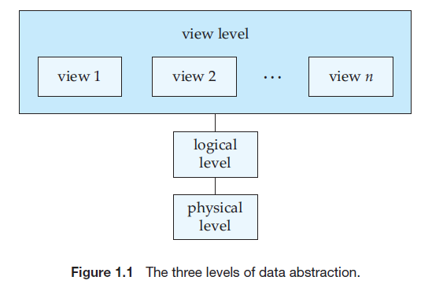
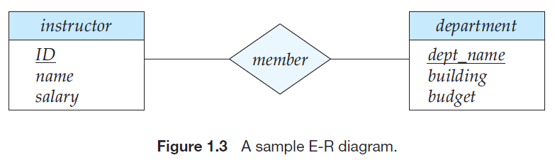

## 数据库系统概念 

## Chapter 1
>A **database-management system** (DBMS) is a collection of interrelated **data** and a set of **programs** to access those data.

- The collection of data, usually referred to as the **database**, contains information relevant to an enterprise.

- The primary goal of a DBMS is to provide a way to store and retrieve database information that is both ==convenient== and ==efficient==.

#### Purpose of Database Systems
- Keeping organizational information in a file-processing system has a number of major disadvantages:
    - data redundancy and inconsistency
    - difficulty in accessing data
    - data isolation
    - integrity problem
    - atomicity problem
    - concurrent-access anomaly
    - security problem
1.  View of Data
- A major purpose of a database system is to provide users with **an abstract view** of the data. That is, the system hides certain details of how the data are stored and maintained.
- ***Why need data abstraction?*** 
To hide the complexity from users through several levels of abstraction and simplify users’ interactions with the system.

- Physical level: The lowest level of abstraction describes $how$ the data are actually stored.The physical level describes complex low-level data structures in detail.

- Logical level:The next-higher level of abstraction describes $what$ data are stored in the database, and what relationships exist among those data. 
    >**Physical data independence**: The ability to modify the physical schema without changing the logical schema

    
    >Database administrators use the logical level of abstraction.
- View level. The highest level of abstraction describes only part of the entire database.

2. Instances and schemas
    >The collection of information stored in the database at a particular moment is called an **instance** of the database. The overall design of the database is called the database **schema**.

- The **physical schema** describes the database design at the physical level, while the **logical schema** describes the database design at the logical level. A database may also have several schemas at the view level, sometimes called **subschemas**, that describe different views of the database.
- Application programs are said to exhibit **physical data independence** if they do not depend on the physical schema, and thus need not be rewritten if the physical schema changes.
3. Data Models
    >Underlying the structure of a database is the **data model**.
- Relational Model
- Entity-Relationship Model
- Object-Based Data Model
- Semistructured Data Model
---
#### Database Languages
>A database system provides a **data-definition language** to specify the database schema and a **data-manipulation language** to express database queries and updates.
- Data-Definition Language, DDL
    - We specify the storage structure and access methods used by the database system by a set of statements in a special type of DDL called a **data storage and definition** language.
    - **Integrity constraints** (***checking when inserting or deleting***):
        - Domain Constraints
        - Referential Integrity
        - Assertions
        - Authorization
    - The DDL gets as input some instructions (statements) and generates some output. The output of the DDL is placed in the **data dictionary**, which contains **metadata**, that is, data about data.
- Data-Manipulation Language, DML
    >A data-manipulation language (DML) is a language that enables users to access or manipulate data as organized by the appropriate data model.

    The types of access are:
    - **Retrieval** of information stored in the database
    - **Insertion** of new information into the database
    - **Deletion** of information from the database
    - **Modification** of information stored in the database

    There are bascially two types of DML:
    - Procedural DMLs require a user to specify $what$ data are needed and $how$ to get those data.
    - Declarative DMLs (also referred to as nonprocedural DMLs) require a user to specify $what$ data are needed $without$ specifying how to get those data.

    > A **query** is a statement requesting the retrieval of information. The portion of a DML that involves information retrieval is called a **query language**.
---
#### Relational Databases
1. Tables
- Each table has multiple columns and each column has a unique name.
2. DML
- The SQL query language is ***nonprocedural***. A query takes as input several tables (possibly only one) and always returns **a single table**.
3. DDL
- SQL provides a rich DDL that allows one to define tables, integrity constraints, assertions, etc.
4. Database Access from Application Programs
- To access the database, DML statements need to be executed from the host language. There are two ways to do this:
    - By providing an application program interface (set of procedures) that can be used to send DML and DDL statements to the database and retrieve the results.
    >Like Open Database Connectivity (ODBC) for the $C$ language and Java Database Connectivity (JDBC) for the $Java$ language.
    - By extending the host language syntax to embed DML calls within the host language program.
    >Usually, a special character prefaces DML calls, and a preprocessor, called the **DML precompiler**, converts the DML statements to normal procedure calls in the host language.
---
#### Database Design 
- The process of designing the general structure of the database:
    - Logical Design –  Deciding on the database schema. Database design requires that we find a “good” collection of relation schemas.
    - Physical Design – Deciding on the physical layout of the database (like the way to storage data...). 
1. Entity Relationship Model
    - Entities are described in a database by a set of **attributes**.
    - A **relationship** is an association among several entities.
    - The set of all entities of the same type and the set of all relationships of the same type are termed **an entity set** and **relationship set**, respectively.
     
    - The overall logical structure (schema) of a database can be expressed graphically by an $entity$-$relationship (E$-$R) diagram$.
    - There are several ways in which to draw these diagrams. One of the most popular is to use the **Unified Modeling Language (UML)**. In the notation we use, which is based on UML, an E-R diagram is represented as follows:
        - **Entity sets** are represented by a rectangular box with the entity set name in the header and the attributes listed below it.
        - **Relationship sets** are represented by a diamond connecting a pair of related entity sets. The name of the relationship is placed inside the diamond.
    
    - In addition to entities and relationships, the E-R model represents certain constraints to which the contents of a database must conform. One important constraint is **mapping cardinalities**, which express the number of entities to which another entity can be associated via a relationship set.
2. Normalization
- To determine whether a relation schema is in one of the desirable normal forms, we need additional information about the real-world enterprise that we are modeling with the database. The most common approach is to use **functional dependencies**.
- A bad design may have:
    - Repetition of information
    - Inability to represent certain information
---
#### Data Storage and Querying
- The functional components of a database system can be broadly divided into 
    - the **storage manager**, and 
    - the **query processor components**.
1. Storage Manager
    > The **storage manager** is the component of a database system that provides the interface between the low-level data stored in the database and the application programs and queries submitted to the system.
    - The storage manager is responsible for ***storing, retrieving, and updating data*** in the database. It contains:
        - **Authorization and integrity manager**
        - **Transaction manager**
        - **File manager**
        - **Buffer manager**
    - The storage manager implements several ==data structures== as part of the physical system implementation:
        - **Data files**, which store the database itself.
        - **Data dictionary**, which stores ==metadata== about the structure of the database, in particular the schema of the database.
        - **Indices**
2. The Query Processor
    - The query processor components include:
        - **DDL interpreter**, which interprets DDL statements and records the definitions in the data dictionary.
        - **DML compiler**, which translates DML statements in a query language into anevaluation plan consisting of low-level instructions that the *query evaluation engine* understands.
        - **Query evaluation engine**, which executes low-level instructions generated by the DML compiler.
    >A query can usually be translated into any of a number of alternative evaluation plans that all ==give the same result==. The DML compiler also performs **query optimization**; that is, it picks the lowest cost evaluation plan from among the alternatives.
---
#### Transaction Management
- **ACID** property:
    - The all-or-none requirement is called **atomicity**. 
    ==Recovery manager's duty==
    - The correctness requirement is called **consistency**.
    ==Concurrency-control manager's duty==
    - Each transaction does not feel that other transactions are executing concurrently in the system: **isolation**.
    ==Concurrency-control manager's duty==
    - The persistence requirement is called **durability**.
    ==Recovery manager's duty==
- A **transaction** is a collection of operations that performs ==a single logical function== in a database application.
- The **transaction manager** consists of the ==concurrency-control manager== and the ==recovery manager==.
- **Failure recovery:** detect system failures and restore the database to the state that existed prior to the occurrence of the failure.