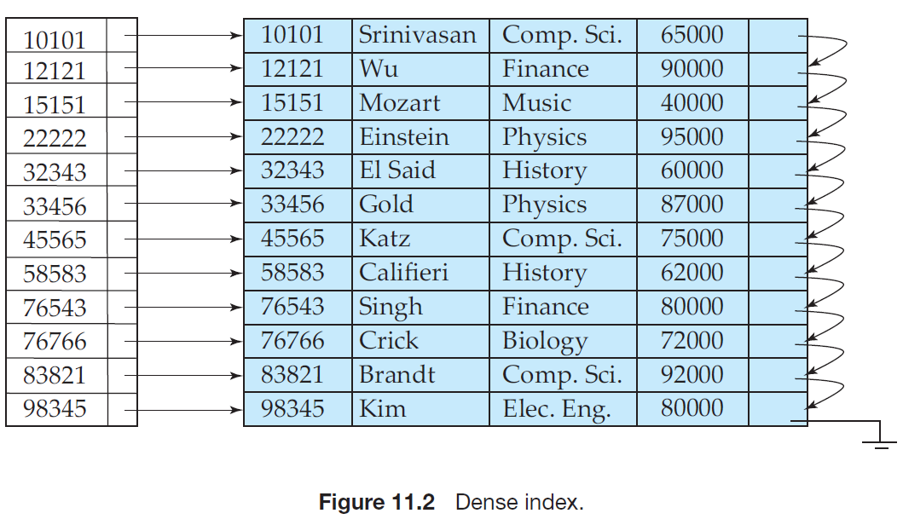
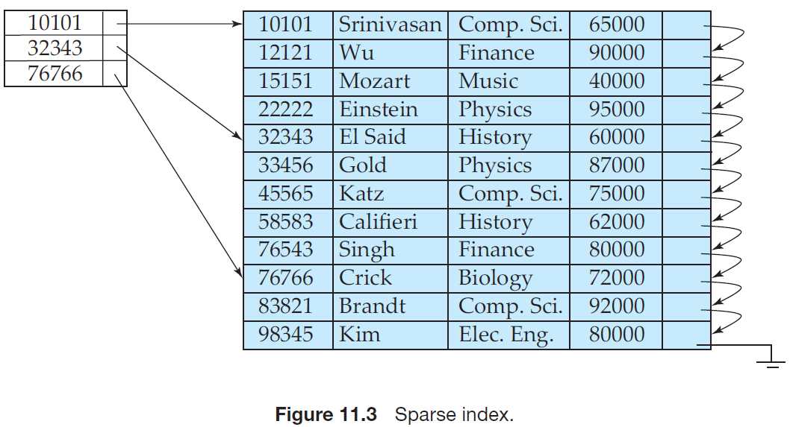
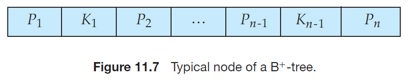
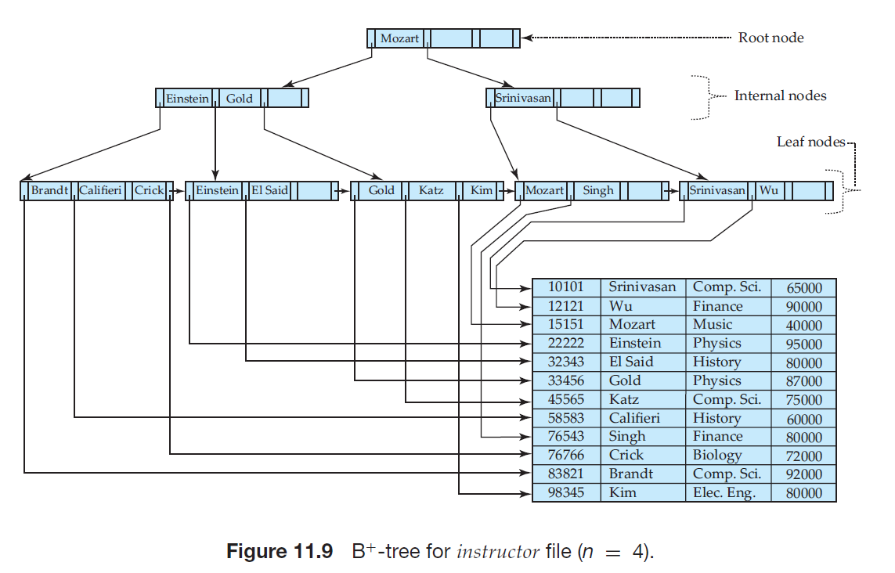
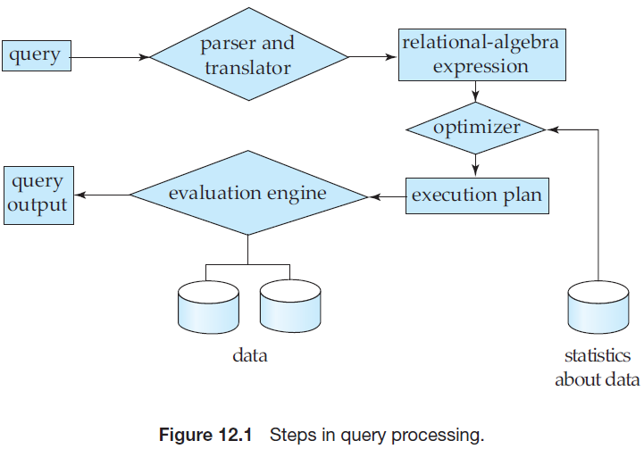

## 数据库系统概念 

## Chapter 11
> 索引是一个数据结构，它对存储在磁盘上数据记录进行分类整理，目的是获得更好的查询速度。
- Indexing mechanisms are used to speed up access to desired data.
- **Search Key**
    > An attribute or set of attributes used to look up records in a file is called a search key.
- There are two basic kinds of indices:
    - **Ordered indices.** Based on a sorted ordering of the values.
    - **Hash indices.** Based on a uniform distribution of values across a range of buckets. The bucket to which a value is assigned is determined by a function, called a *hash function*.
#### Sequential File
> Suitable for applications that require sequential processing of the entire file. The records in the file are ordered by a *search-key*.
- **Clustering index**
    > If the file containing the records is sequentially ordered, a clustering index (or *primary index*) is an index whose search key also defines the sequential order of the file.
- **Nonclustering index**
    > Indices whose search key specifies an order *different* from the sequential order of the file are called nonclustering indices, or *secondary indices*.
- **Index-sequential files**
    > Such files, with a clustering index on the search key, are called index-sequential files.
- An **index entry**, or **index record**, consists of a *search-key value* and *pointers* to one or more records with that value as their search-key value.
- There are two types of ordered indices that we can use:
    - **dense index**
    **one search key value $\leftrightarrow$ one entry**
    
     
    - **sparse index**
    **multi-search-key values $\leftrightarrow$ one entry**
    
        - Sparse indices can be used **only if** the relation is stored in sorted order of the search key, that is, if the index is a *clustering index*. 
- Multi-level Index
    > Indices with two or more levels are called multilevel indices.
-  Secondary index
    - Secondary indices must be **dense**.
- Indices on Multiple Keys
    - A search key containing more than one attribute is referred to as a **composite search key**.
    - The ordering of search-key values is the *lexicographic ordering*. For example, for the case of two attribute search keys, (a1, a2) < (b1, b2) if either a1 < b1 or a1 = b1 and a2 < b2. *Lexicographic ordering is basically the same as alphabetic ordering of words*.
#### B+ -Tree Index Files 
- A B+-tree index takes the form of a *balanced tree* in which every path from the root of the tree to a leaf of the tree is of the same length. 
- Each **nonleaf node** in the tree has between $\lceil n/2 \rceil$ and $n$ children, where $n$ is fixed for a particular tree.
- Each **leaf** can hold up to $n − 1$ values and must contain as few as $\lceil(n − 1)/2\rceil$ values.
- The **root node** can hold fewer than $\lceil n/2\rceil$ pointers; however, it must hold at least $2$ pointers, unless the tree consists of only $1$ node.

- Typical node of a B+-tree contains up to $n − 1$ search-key values $K_1,\ K_2,\ \dots,\ K_{n−1}$, and $n$ pointers $P_1,\ P_2,\ \dots,\ P_n$. The search-key values within a node are kept in sorted order; thus, if $i < j$, then $K_i < K_j$ .

- **B+树的效率**
    - **访问索引的I/O代价**
        - B+树不常驻内存：树高
        - B+树常驻内存：0
    - B+树树高通常不超过3层，因此索引I/O代价不超过3（**总代价不超过4**）

#### Static Hashing
- Bucket
    > A unit of storage that can store one or more records. A bucket is typically a disk block, but could be chosen to be smaller or larger than a disk block.
- Hash function
    > Formally, let $K$ denote the set of all search-key values, and let $B$ denote the set of all bucket addresses. **A hash function $h$ is a function from $K$ to $B$.** Let $h$ denote a hash function.
- We want to choose a hash function that assigns search-key values to buckets in such a way that the distribution has these qualities:
    - The distribution is **uniform**.
    - The distribution is **random**.
- **散列表的空间利用率**
    $$空间利用率=\frac{实际码值数}{所有桶可放置的码值数}$$
    - $<50\%$：**空间浪费**
    - $50\%\sim80\%$：**良好**
    - $>80\%$：**溢出问题**
#### Dynamic Hashing (Extendable Hashing)
> Dynamic hashing techniques allow the hash function to be modified dynamically to accommodate the growth or shrinkage of the database.
- Extendable hashing copes with changes in database size by splitting and coalescing buckets as the database grows and shrinks.
- 散列函数$h(k)$是一个$b$（足够大）位二进制序列，前$i$位表示桶的数目（用来区分桶）。$i$的值随数据文件的增长而增大。
 
- **补充：线性散列表**
    - $h(k)$仍是二进制位序列，但使用右边（低）$i$位区分桶
    - 桶数$＝n$，$h(k)$的右$i$位$＝m$
    - 若$m<n$，则记录位于第$m$个桶
    - 若$n \leq m < 2^i$，则记录位于第 $m-2^{i-1}$ 个桶
    - $n$的选择：总是使$n$与当前记录总数$r$保持某个固定比例（==意味着只有当桶的填充度超过某个比例后桶数才开始增长==）
---
## Chapter 12
The steps involved in processing a query appear in Figure 12.1. The basic steps are:
1. Parsing and translation.
2. Optimization.
3. Evaluation.

> A relational algebra operation *annotated with instructions on how to evaluate it* is called an **evaluation primitive**. A sequence of primitive operations that can be used to evaluate a query is a **query-execution plan** or **query-evaluation plan**.
The **query-execution engine** takes a query-evaluation plan, executes that plan, and returns the answers to the query.
#### 查询代价的度量
> 我们用<b>传送磁盘块数 (number of block transfers)</b>以及<b>搜索磁盘次数 (number of disk seeks)</b>来度量查询计划的代价。
- ==一次磁盘搜索的代价比一次块传输要高==
- 符号含义：
    - $t_T$：磁盘传输一个块的数据的平均耗时
    - $t_S$：磁盘块平均访问（磁盘搜索加上旋转延迟）时间
- 优化器通常努力去尽可能降低查询计划总的**资源消耗 (resource consumption)**，而不是尽可能降低响应时间 (response time)

1. 选择运算 **选择算法代价估计**

算法|开销
:---:|:---:
线性搜索|$t_s+b_r*t_T$
线性搜索，码属性上等值比较|$t_s+\frac{1}{2}*b_r*t_T$（平均）
b+树**主**索引，**码属性**上等值比较 b+树**辅助**索引，**码属性**上等值比较|$(h_i+1)*(t_s+t_T)$
b+树**主**索引，**非码属性**上等值比较 b+树**主**索引，比较|$h_i*(t_s+t_T)+b_r*t_T$
b+树**辅助**索引，**非码属性**上等值比较 b+树**辅助**索引，比较|$(h_i+n)*(t_s+t_T)$

- 其中 $b_r$ 是记录的磁盘块数，$h_i$ 是b+树的高度，$n$ 是所取记录数

2. 排序运算 **外排序——外部归并排序**
令 $b_r$ 表示记录的磁盘块数，$M$ 为内存缓冲区能容纳的磁盘块数
$b_b$ 表示每次从一个归并段读取的磁盘块数，并假设输出阶段一次性输出的磁盘块数也为 $b_b$
    - “ $*2$ ”是因为 读 $+$ 写，*假设最后一次归并结果也写回磁盘*
     
    - 第一阶段（预排序）：产生归并段 
    **磁盘传输次数**：$2*b_r$<b>磁盘搜索次数</b>： $2*\lceil\frac{b_r}{M}\rceil$    
    - 第二阶段（归并）：N路归并 
    **磁盘传输次数**：$2*\lceil\mathrm{log}_{M-1}(\frac{b_r}{M})\rceil*b_r$
    **磁盘搜索次数**: $2*\lceil\mathrm{log}_{\lfloor M/b_b\rfloor-1}(\frac{b_r}{M})\rceil*\lceil\frac{b_r}{b_b}\rceil$
     
    - **总共的磁盘块传输次数为** $2b_r*(\lceil\mathrm{log}_{M-1}(\frac{b_r}{M})\rceil+1)$
    - **总共的磁盘搜索次数为**$2*\lceil\frac{b_r}{M}\rceil+2*\lceil\mathrm{log}_{\lfloor M/b_b\rfloor-1}(\frac{b_r}{M})\rceil*\lceil\frac{b_r}{b_b}\rceil$
3. 连接运算
- 符号含义：
    - $n_r$： 关系 $r$ 的记录数
    - $b_r$： 关系 $r$ 记录所占的磁盘块数
-  **嵌套循环连接 (nested-loop join)**
    > 嵌套循环连接不要求有索引，并且不管连接条件是什么，该算法均可使用。
    - 外层关系为 $r$，内层关系为 $s$ 时：
        - 块传输**最坏代价**：$n_r*b_s+b_r$；==选择记录数小的关系作为内层关系==，当内层关系能完全装入内存时有**最好代价**：$b_s+b_r$
        - 磁盘搜索 **最坏代价**： $n_r+b_r$， **最好代价**：$2$
- **块嵌套循环连接 (block nested-loop join, BNL)**
    > 在最坏的情况下，BNL对于外层关系中的每一个块，内层关系$s$的每一块只须读一次。
    - 块传输 **最坏代价**：$b_r*b_s+b_r$，**最好代价**：$b_s+b_r$
    - 磁盘搜索 **最坏代价**：$2b_r$，**最好代价**：$2$
    - **改进的BNL**，外层关系可以不用磁盘块作为分块的单位，而以内存中最多能容纳的磁盘块大小为单位，同时要留出足够的缓存空间给内层关系及输出结果使用。
- **索引嵌套循环 (indexed nested-loop join)**
    > 若在内层循环的连接属性上有索引，则可以通过索引查找替代文件扫描。
    - 如果两个关系$r$、$s$上均有索引时，==一般把元组较少的关系作为外层关系==
    - **代价**：$b_r(t_T+t_s)+n_r*c$，其中$c$是使用连接条件对关系$s$进行单次选择操作的代价
- **归并连接 (sort-merge join)**
    > 使用归并排序将 $r$ 和 $s$ 两个关系按连接属性上的值排序，一旦关系已排序，在连接属性上有相同值的元组都是连续存放的，所以已排序的每一个元组只须读入一次，因而每一个块也只须读一次。
    - **代价**：
        - 块传输：归并排序块传输代价 $+$ 连接代价 $(b_r+b_s)$
        - 磁盘搜索： 归并排序磁盘搜索 $+$ 连接代价 $(b_r+b_s)$
- **散列连接 (hash join)**
    > 通过散列函数将 $r$ 和 $s$ 两个关系中的记录不断进行划分，直到其中一个划分可以完全装入内存时，再执行连接操作。
---
####Evaluation of Expressions
>There are two ways to evaluate an expression containing multiple operations: 
>1. materialized 
>2. pipeline.
1. Materialization
    > **Materialized evaluation**: the results of each intermediate operation are created (materialized) and then are used for evaluation of the next-level operations.

    > **Double buffering**: using two buffers, with one continuing execution of the algorithm while the other is being written out. It allows the algorithm to execute more quickly by performing CPU activity in parallel with I/O activity.
2. Pipelining
    > **Pipelining**: combine several relational operations into a pipeline of operations, in which the results of one operation are passed along to the next operation in the pipeline.
    - Creating a pipeline of operations can provide two benefits:
        - It eliminates the cost of reading and writing temporary relations, reducing the cost of query evaluation.
        - It can start generating query results quickly, if the root operator of a queryevaluation plan is combined in a pipeline with its inputs.

---
## Chapter 13
> **Query optimization** is the process of selecting **the most efficient** query-evaluation plan from among the many strategies usually possible for processing a given query, especially if the query is complex.
- Generation of query-evaluation plans involves **three steps**: 
    - generating expressions that are logically equivalent to the given expression, 
    - annotating the resultant expressions in alternative ways to generate alternative query-evaluation plans, and 
    - **estimating** the cost of each evaluation plan, and choosing the one whose estimated cost is the least.
- **查询优化的两种途经**
    - 对查询语句进行变换，例如改变基本操作的次序，使查询语句执行起来更有效。这种查询优化方法仅涉及查询语句本身，而**不涉及存取路径，称为独立于存取路径的优化**，或称==代数优化==。代数优化的目的是==尽量减少查询过程中的中间结果的大小==。 
    - 根据系统所提供的存取路径，选择合理的存取策略，例如选用顺序搜索、索引等存取路径进行查询，这称为**依赖于存取路径的优化**，或称==物理优化==。 
#### Transformation of Relational Expressions
- Two relational-algebra expressions are said to be **equivalent** if, on every legal database instance, the two expressions generate the same set of tuples.
> ==A legal database instance is one that satisfies all the integrity constraints specified in the database schema.==
1. 等价规则
    - 级联选择
    $$\sigma_{\theta_1 \wedge \theta_2}(E)=\sigma_{\theta_1}(\sigma_{\theta_2}(E))$$
    - 交换选择
    $$\sigma_{\theta_1}(\sigma_{\theta_2}(E))=\sigma_{\theta_2}(\sigma_{\theta_1}(E))$$
    - 级联投影
    $$\Pi_{L_1}((\Pi_{L_2}(\dots(\Pi_{L_n}(E))\dots)))=\Pi_{L_1}(E)$$
    - 选择操作可与笛卡尔积以及 $\theta$ 连接相结合

    $$\sigma_\theta(E_1\times E_2)=E_1 \bowtie_\theta E_2$$

    $$\sigma_\theta(E_1\bowtie_\theta E_2)=E_1 \bowtie_{\theta_1 \wedge \theta_2} E_2$$

    - $\theta$ 连接满足交换律 
    $$E_1 \bowtie_\theta E_2=E_2 \bowtie_\theta E_1$$
    - $\theta$ 连接满足结合律
    $$(E_1\bowtie_{\theta_1}E_2)\bowtie_{\theta_2 \wedge \theta_3}E_3=E_1\bowtie_{\theta_1 \wedge \theta_3}(E_2\bowtie_{\theta_2}E_3)$$其中 $\theta_2$ 只涉及 $E_2$ 和 $E_3$ 的属性
2. **规则优化的一般步骤**
    - 把所有选择操作的==合取条件分割成选择操作级联==。
    - `Select`操作与其他操作交换，==尽早执行选择操作==。
    - 用连接、笛卡儿乘积的交换律和结合律，按照==小关系先做的原则==，重新安排连接（笛卡儿积）的次序。
    - 如果笛卡儿乘积后还须按连接条件进行选择操作，可以将两者组合成连接操作。
    - 用关于级联投影以及其他运算的规则，分割并移动投影列表，==尽量把投影向下推==，并在必要时增加新的投影操作，以消除对查询无用的属性。

