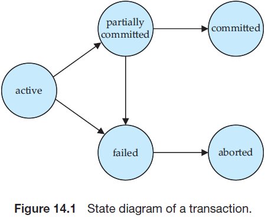
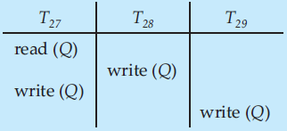

## 数据库系统概念
## Chapter 14
#### Transaction Concept
> Collections of operations that form a single logical unit of work are called **transactions**.
- **Atomicity**. Either all operations of the transaction are reflected properly in the database, or none are.
- **Consistency**. Execution of a transaction in isolation (that is, with no other transaction executing concurrently) preserves the consistency of the database.
- **Isolation**. Even though multiple transactions may execute concurrently, the system guarantees that, for every pair of transactions $T_i$ and $T_j$ , it appears to $T_i$ that either $T_j$ finished execution before $T_i$ started or $T_j$ started execution after $T_i$ finished. Thus, each transaction is unaware of other transactions executing concurrently in the system.
- **Durability**. After a transaction completes successfully, the changes it has made to the database persist, even if there are system failures
#### Transaction Atomicity and Durability
> A transaction must be in one of the following states:
> - **Active**, the initial state; the transaction stays in this statewhile it is executing.
> - **Partially committed**, after the final statement has been executed.
> - **Failed**, after the discovery that normal execution can no longer proceed.
> - **Aborted**, after the transaction has been rolled back and the database has been restored to its state prior to the start of the transaction.
> - **Committed**, after successful completion.

- A transaction is said to have **terminated** if it has either *committed* or *aborted*.
- After the transaction abortion, the system has two choices:
    - It can **restart** the transaction
    - It can **kill** the transaction
#### Serializability
- **Serial Schedule**
    > Each serial schedule consists of a sequence of instructions from various transactions, where the instructions belonging to one single transaction **appear together** in that schedule.
- Multiple transactions are allowed to run concurrently in the system. Advantages are:
    - **increased processor and disk utilization**
    - **reduced average response time**
- Schedule
    > A sequences of instructions that specify the chronological order in which instructions of concurrent transactions are executed.

- A (possibly concurrent) schedule is **serializable** if it is equivalent to a serial schedule. Different forms of schedule equivalence give rise to the notions of:
    1.	**conflict serializability**
    2.	**view serializability**

- **Conflicting Instructions**
    - $Ii = read(Q), I_j = read(Q)$.   $I_i$ and $I_j$ don’t conflict
    - $I_i = read(Q),  I_j = write(Q)$.  They conflict
    - $I_i = write(Q), I_j = read(Q)$.   They conflict
    - $I_i = write(Q), I_j = write(Q)$.  They conflict
- **Conflict serializability**
    - If a schedule $S$ can be transformed into a schedule $S´$ by a series of swaps of non-conflicting instructions, we say that $S$ and $S´$ are **conflict equivalent**.
    - We say that a schedule $S$ is **conflict serializable** if it is conflict equivalent to a serial schedule.
- **View serializability**
    - Let $S$ and $S´$ be two schedules with the same set of transactions. $S$ and $S´$ are **view equivalent** if the following three conditions are met:
        1.	For each data item $Q$, if transaction $I_i$ reads the initial value of $Q$ in schedule $S$, then transaction $I_i$  must, in schedule $S´$, also read the initial value of $Q$.
        2.	For each data item $Q$ if transaction $I_i$ executes read($Q$) in schedule $S$, and that value was produced by transaction $I_j$ (if any), then transaction $I_i$ must in schedule $S´$ also read the value of Q that was produced by transaction $I_j$ .
        3.	For each data item $Q$, the transaction (if any) that performs the final write($Q$) operation in schedule $S$ must perform the final write($Q$) operation in schedule $S´$.
    - This schedule is view serializable. \<T~27~, T~28~, T~29~>
    
    - A schedule S is **view serializable** if it is view equivalent to a serial schedule.
    - ==Every conflict serializable schedule is also view serializable.==
    - ==Some view serializable schedules are not conflict serializable.==
    - Every view serializable schedule that is not conflict serializable has *blind writes* ==(write($Q$) in T~28~ and T~29~)==.
    - Blind writes
        > Perform write(Q) operations without having performed a read(Q) operation.
- Testing for Serializability
    - **Precedence graph** — a direct graph where the vertices are the transactions (names).
    - ==A schedule is conflict serializable if and only if its precedence graph is **acyclic**.==
#### Transaction Isolation and Atomicity
- **Recoverable Schedules**
    > If a transaction $T_j$ reads a data item previously written by a transaction $T_i$, then the commit operation of $T_i$ appears before the commit operation of $T_j$.
- **Cascadeless Schedules**
    > For each pair of transactions $T_i$ and $T_j$ such that $T_j$ reads a data item previously written by $T_i$, the commit operation of $T_i$ appears before the read operation of $T_j$.
    - ==Every cascadeless schedule is also recoverable.==
---
## Chapter 15
#### Lock-Based Protocols
- A lock is a mechanism to control **concurrent access** to a data item.
- Data items can be locked in two modes:
    - **Exclusive (X) mode**. Data item can be both read as well as  written. X-lock is requested using **lock-X** instruction
    - **Shared (S) mode**. Data item can only be read. **S-lock** is requested using lock-S instruction
- A transaction may be granted a lock on an item if the requested lock is **compatible** with locks already held on the item by other transactions
- Any number of transactions can hold shared locks on an item, but if any transaction holds an exclusive on the item no other transaction may hold any lock on the item.
- If a lock cannot be granted, the requesting transaction is made to **wait** till all incompatible locks held by other transactions have been released.  The lock is then granted.
- **Two-phase locking protocal**
    - ==It ensures conflict-serializable schedules.==
    > Phase 1: **Growing Phase**
    >   - transaction may obtain locks 
    >   - transaction may not release locks
    > 
    > Phase 2: **Shrinking Phase**
    >   - transaction may release locks
    >   - transaction may not obtain locks
    - The protocol assures serializability. It can be proved that the transactions can be serialized in the order of their **lock points**  ==(i.e. the point where a transaction acquired its final lock)==. 
    - The protocal ***doesn't ensure*** freedom from **deadlocks**
- **Strict two-phase locking protocal**
    - *Cascading rollbacks* can be avoided by a modification of two-phase locking called the strict two-phase locking protocol. 
    - This protocol requires not only that locking be two phase, but also that ==all exclusive-mode locks taken by a transaction be held until that transaction commits==.
- **Rigorous two-phase locking protocol**
    - It requires that ==all locks== be held until the transaction commits.
    - With rigorous two-phase locking, ==transactions can be serialized in the order in which they commit==.
- Lock Conversions
    - Growing phase can convert a lock-S to a lock-X (upgrade)
    - Shrinking phase can convert a lock-X to a lock-S  (downgrade)
#### Deadlock Handling
> System is deadlocked if there is a set of transactions such that every transaction in the set is waiting for another transaction in the set.
- Deadlock Prevention
    If $T_i$ wants the data currently held by $T_j$:
    - **wait-die**: non-preemptive
    If $T_i$ is older (its timestamp is smaller) than $T_j$, $T_i$ can wait. Otherwise $T_i$ roll backs.
    - **wound-wait**: preemptive
    If $T_i$ is younger (its timestamp is larger) than $T_j$, $T_i$ can wait. Otherwise $T_j$ roll backs.
    - **lock timeout**
    A transaction waits for a lock only for **a specified amount of time**. After that, the wait times out and the transaction is rolled back.

- Deadlock Detection
    - wait-for graph
    $T_i \rightarrow T_j$ if $T_i$ is waiting for $T_j$ releasing data.
    - ==The system is in a deadlock state if and only if the wait-for graph has a cycle.==  Must invoke a deadlock-detection algorithm periodically to look for cycles.
- Deadlock Recovery
    - When deadlock is detected, some transaction will have to rolled back (made a victim) to break deadlock.  
    - Select that transaction as victim that will **incur minimum cost**.
    - *Starvation* happens **if same transaction is always chosen as victim**. Include the number of rollbacks in the cost factor to avoid starvation

#### Timestamp-Based Protocols
- **W-timestamp(Q)**
denotes the largest timestamp of any transaction that executed write(Q) successfully.
- **R-timestamp(Q)**
denotes the largest timestamp of any transaction that executed read(Q) successfully.
- **The Timestamp-Ordering Protocol**
    - ==It ensures confict serializable schedules and freedom from deadlock.==
    - ==May occur starvation and unrecoverable schedules.==
    > This protocol operates as follows:
    > - Suppose that transaction T~i~ issues read(Q).
    >   - If TS(T~i~) < W-timestamp(Q), then T~i~ needs to read a value of Q that was already overwritten. Hence, the read operation is rejected, and T~i~ is rolled back.
    >   - If TS(T~i~) ≥ W-timestamp(Q), then the read operation is executed, and R-timestamp(Q) is set to the maximum of R-timestamp(Q) and TS(T~i~).
    >
    > - Suppose that transaction T~i~ issues write(Q).
    >   - If TS(T~i~) < R-timestamp(Q), then the value of Q that T~i~ is producing was needed previously, and the system assumed that that value would never be produced. Hence, the system rejects the write operation and rolls T~i~ back.
    >   - If TS(T~i~) < W-timestamp(Q), then T~i~ is attempting to write an obsolete value of Q. Hence, the system rejects this write operation and rolls T~i~ back.
    >   - Otherwise, the system executes the write operation and sets W-timestamp(Q) to TS(T~i~).
- **Thomas’ Write Rule**
    - ==It ensures view serializable schedules.==
    - Modiefied *Timestamp-Ordering Protocol*:
    > - Suppose that transaction T~i~ issues write(Q).
    >   - If TS(T~i~) < R-timestamp(Q), then the value of Q that T~i~ is producing was needed previously, and the system assumed that that value would never be produced. Hence, the system rejects the write operation and rolls T~i~ back.
    >   - If TS(T~i~) < W-timestamp(Q), then T~i~ is attempting to write an **obsolete** value of Q. Hence, this write operation can be **ignored**.
    >   - Otherwise, the system executes the write operation and sets W-timestamp(Q) to TS(T~i~).