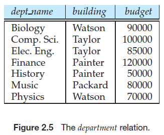
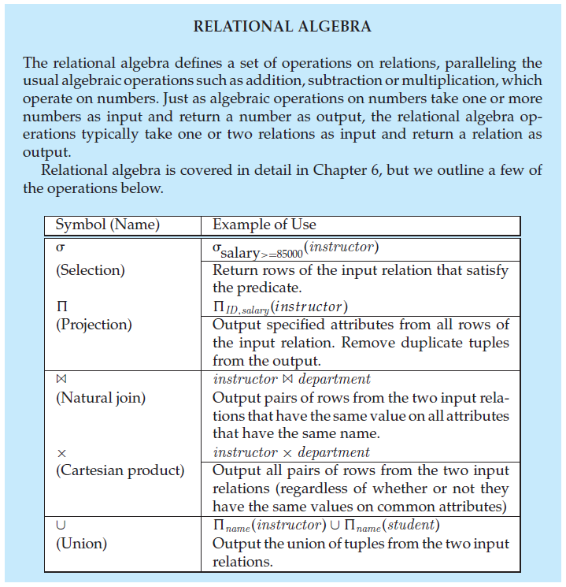

## 数据库系统概念

## Chapter 2
#### Structure of Relational Databases

>In the relational model the term **relation** is used to refer to a table, while the term **tuple** is used to refer to a row. Similarly, the term **attribute** refers to a column of a table. The term **relation instance** is used to refer to a specific instance of a relation, i.e., containing a specific set of rows.
- **Domain**: For each attribute of a relation, there is a set of permitted values, called the domain of that attribute.
- **Atomic**: A domain is atomic if elements of the domain are considered to be indivisible units. (*The important issue is not what the domain itself is, but rather how we use domain elements in our database.*)

---
#### Database Schema
>The concept of a relation corresponds to the programming-language notion of a *variable*, while the concept of a **relation schema** corresponds to the programming-language notion of *type definition*.
- In general, a relation schema consists of **a list of attributes and their corresponding domains**.

- For instance, the schema for the department relation of Figure 2.5 is:
$$department (dept\_ name,\ building,\ budget)$$
---
#### Keys
- **Superkey**:
Let K $\subseteq$ R, K is a ***superkey*** of R if values for K are sufficient to identify a unique tuple of each possible relation r(R). 
- **Candidate key**:
K is a ***candidate key*** if K is one of the minimal superkeys (i.e., *no proper subset of K is a superkey*).
- **Primary key**:
The term ***primary key*** is used to denote a candidate key that is chosen by the database designer as the principal means of identifying tuples within a relation.
    >A relation, say r<sub>1</sub>, may include among its attributes the primary key of another relation, say r<sub>2</sub>. This attribute is called a ***foreign key*** from r<sub>1</sub>, referencing r<sub>2</sub>. The relation r<sub>1</sub> is also called the **referencing relation** of the foreign key dependency, and r<sub>2</sub> is called the **referenced relation** of the foreign key.
---
#### Relational Query Languages
- A **query language** is a language in which a user requests information from the database.
---
#### Relational Operations
- The Relational Operations have the nice and desired property that their result is always a *single* relation.



---
## Chapter 5
#### Triggers
>A **trigger** is a statement that the system executes automatically as a side effect of a modification to the database. It is a special type of **stored procedure**.
- To design a trigger mechanism, we must meet **two requirements**:
    1. Specify when a trigger is to be executed. This is broken up into an **event** that causes the trigger to be checked and a **condition** that must be satisfied for trigger execution to proceed.
    2. Specify the **actions** to be taken when the trigger executes. 
- **Usages**:
    - Compare different versions of data.
    - Read data from tables in other databases.
    - Modification or deletion of all associated tables in the database
    - Rollback invalid changes.
    - Enforce more complex restrictions than those provided by the CHECK constraint.
    - Execute local and remote stored procedures.
- Template:
    - Create or modify a trigger:
    ```SQL
    CREATE OR MODIFY TRIGGER trigger_name
    WHEN EVENT
    ON table_name TRIGGER_TYPE
    EXECUTE stored_procedure;
    ```
    >**WHEN**
    >- `BEFORE` –invoke before the event occurs
    >- `AFTER` –invoke after the event occurs
    ><br/>
    >
    >**EVENT**
    >- `INSERT` –invoke for INSERT
    >- `UPDATE` –invoke for UPDATE
    >- `DELETE` –invoke for DELETE
    ><br/>
    >
    >**TRIGGER_TYPE**
    >- `FOR EACH ROW`
    >- `FOR EACH STATEMENT`
    - Delete a trigger:
    ```SQL
    DROP TRIGGER trigger_name;
    ```