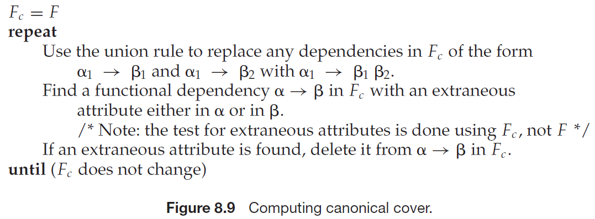

# 数据库系统概念 
## Chapter 7

#### Overview of the Design Process
1. Design Phase
    - **Demand analysis**: Characterize fully the data needs of the prospective database users
    - **Conceptual-design**: Choose a data model and translate these requirements into a conceptual schema of the database
    - **Logical-design**: Deciding on the database schema
    - **Physical-design**: Deciding on the physical layout of the database   
2. Design Alternatives
- In designing a database schema, we must ensure that we avoid two major pitfalls:
    - **Redundancy**
    - **Incompleteness**
---
#### The Entity-Relationship Model
1. Entity 
    > An entity is a “thing” or “object” in the real world that is distinguishable from all other objects. An entity is represented by a set of ***attributes***.
2. Entity set
    > An entity set is a set of entities of the same type that share the same properties,
or attributes.
3. Extension
    > An extension of the entity set is the ***actual*** collection of entities belonging to the entity set.
4. Relationship
    > A relationship is an association among several entities.
5. Relationship set
    > A relationship set is a set of relationships of the same type.
6. Participation
    > The association between entity sets is referred to as participation
7. Role
    > The function that an entity plays in a relationship is called that entity’s role.
8. Degree
    > The number of entity sets that participate in a relationship set is the degree of the relationship set.
9. Attribute
- *simpe* vs *composite*
- *single-valued* vs *multivalued*
- *derived*

---
#### Constraints
1. Mapping cardinality
- For a binary relationship set *R* between entity sets *A* and *B*, the mapping cardinality must be one of the following:
    - one-to-one
    - one-to-many
    - many-to-one
    - many-to-many

2. Participation Constraints
The participation of an entity set E in a relationship set R is said to be ***total*** if every entity in E participates in at least one relationship in R. 
If only some entities in E participate in relationships in R, the participation of entity set E in relationship R is said to be ***partial***.

---
#### Entity-Relationship Diagrams
1. 基本结构
- **分成两部分的矩形**代表实体集
- **菱形**代表联系集
- **未分割的矩形**代表联系集的属性
- **线段**将实体集连接到联系集
- **虚线**将联系集属性连接到联系集
- **双线**显示实体在联系集中的参与度
- **双菱形**代表连接到弱实体集的标志性联系集
2. 映射基数
- 箭头（→）指向的实体集的映射基数为1
3. 角色 ([role](#role))
 
4. 弱实体集 (weak entity set)
    > An entity set that does not have sufficient attributes to form a primary key is termed a ***weak entity set***. An entity set that has a primary key is termed a ***strong entity set***.
- For a weak entity set to be meaningful, it must be associated with another entity set, called the ***identifying*** or ***owner entity set***.

- The relationship associating the weak entity set with the identifying entity set is called the ***identifying relationship***.
- The ***discriminator***, also called ***partial key***, of a weak entity set is a set of *attributes* that allows this distinction to be made. ==The discriminator plus its identifying's primary key composites of the primary key of the weak entity set.==
    >The discriminator of a weak entity is underlined with a dashed(`---`), rather than a solid, line.
---
#### Reduction to Relational Schemas
1. **Representation of Strong Entity Sets with Simple Attributes**
- For schemas derived from strong entity sets, the primary key of the entity set serves as the primary key of the resulting schema.
2. **Representation of Strong Entity Sets with Complex Attributes**

- We handle composite attributes by **creating a separate attribute for each of the component attributes**; we ***do not*** create a separate attribute for the composite attribute itself.
    - i.e., `name {first_name, middle_name, last_name}` will be represented as `(first_name, middle_name, last_name)`
- **New** relation schemas are created for multivalued attributes. 
    > For a multivalued attribute $M$, we create a relation schema $R$ with an attribute $A$ that corresponds to $M$ and attributes corresponding to the primary key of the entity set or relationship set of which $M$ is an attribute.
    - i.e., `phone_number` is the multivalued attribute $M$, create new schema $R$ `inst_phone(ID,  phone_number)`, the attribute `phone_number` in $R$ is referred to the attribute $A$.  
3. **Representation of Weak Entity Sets**
- Let $A$ be a weak entity set with attributes $a_1, a_2, \ \dots, a_m$. Let $B$ be the strong entity set on which $A$ depends. Let the primary key of $B$ consist of attributes $b_1, b_2,\ \dots, b_n$. We represent the entity set $A$ by a relation schema called $A$ with one attribute for each member of the set:
$$\{a_1,a_2,\ \dots a_m\}\cup\{b_1,b_2,\ \dots,b_n\}$$
    - In addition to creating a primary key, we also create a **foreign-key constraint** on the relation A, specifying that the attributes $b_1, b_2,\ \dots, b_n$ reference the primary key of the relation B.
4. **Representation of Relationship Sets**
- 在实体集$A$和$B$上的联系集$R$的主码可以定义为$primary\_key(A) \cup primary\_key(B)$
    - 当$A$和$B$为一对一关系时，则$primary\_key(A)$或者$primary\_key(B)$都能作为$R$的主码
    - 当$A$和$B$为一对多或多对一关系时，“多”的那一方的实体的主码作为关系的主码
- **一个非二元的联系集总可以用一组不同的二元联系集来替代**
- **模式的冗余**
    - 一般情况下，连接弱实体集与其所依赖的强实体集的联系集的模式是冗余的，不需要列入关系模式中
- **模式的合并**
    - 对于实体集$A$到实体集$B$的一个**多对一**的联系集$AB$，如果$A$在联系中**全部参与**，则可以将$A$和$AB$模式合并成**单个**包含两个模式所有属性的并集的模式
    - 在**一对一**的联系的情况下，联系集的关系模式可以跟参与联系的任何一个实体集的模式进行合并
    - 注意参照完整性约束
---
#### Extended E-R Features
1. Specialization
    > The process of designating subgroupings within an entity set is called specialization.
- overlapping specialization （分开的两个箭头）
- disjoint specialization （使用一个共同的箭头）

2. Generalization
    > Generalization is a ***containment relationship*** that exists between a higher-level entity set and one or more lower-level entity sets.

3. Attribute Inheritance
- single inheritance
- multiple inheritance 产生 **格 (lattice)**

4. Aggregation
- "*relationships among relationships*"
    > Aggregation is an abstraction through which relationships are treated as higher-level entities.

---
## Chapter 8 Relational Database Design

#### Overview
- 不良的模式设计存在
    - 数据冗余
    - 插入异常
    - 删除异常
    - 更新异常
- 一个**好**的关系模式应该具备
    - 尽可能少的数据冗余
    - 没有插入异常
    - 没有删除异常
    - 没有更新异常
- **关系模式的表示**
    - 完整表示 ==五元组==
    $(R,\ U,\ D,\ Dom,\ F)$
        - R为关系名
        - U为关系的属性集合
        - D为属性集U中属性的数据域
        - Dom为属性到域的映射
        - F为属性集U的**数据依赖集**（包括**函数依赖、多值依赖、连接依赖**）
    - 简单表示 ==三元组==
    $(R,\ U,\ F)$
- **函数依赖**
设关系模式$(R,\ U,\ F)$，$U$是属性全集，$F$是$U$上的函数依赖集，$X$和$Y$是$U$的子集，如果对于$R(U)$的任意一个可能的关系$r$，对于$X$的每一个具体值，$Y$都有唯一的具体值与之对应（也就是对任意$t1$、$t2\in r$, 如果 $t1[X]=t2[X]$ 有$t1[Y]=t2[Y]$），则称$X$决定函数$Y$，或$Y$函数依赖于$X$，记作$X→Y$。我们称$X$为决定因素，$Y$为依赖因素。
    - **平凡 \ 非平凡 函数依赖** ==若不特别声明，我们讨论的都是非平凡的函数依赖==
    - **部分 \ 完全 函数依赖** ==只有当决定因素是组合属性时，讨论部分函数依赖才有意义，当决定因素是单属性时，只能是完全函数依赖==
    - **传递函数依赖** 
    > 函数依赖是语义范畴的概念
    > 函数依赖关系的存在与时间无关
    > 函数依赖与属性之间的联系类型有关

#### Armstrong's Axiom System
> armstrong公理系统是一套推理规则，是模式分解算法的理论基础。
- **自反律**：若$Y\subseteq X\subseteq U$，则$X→Y$为$F$所蕴含
- **增广律**：若$X→Y$为$F$所蕴含，且$Z\subseteq U$，则$XZ→YZ$为$F$所蕴含。
- **传递律**：若$X→Y$及$Y→Z$为$F$所蕴含，则$X→Z$为$F$所蕴含。

**推理**：
- 合并规则
- 伪传递规则
- 分解规则

#### Closure of Attribute Sets
> An attribute B is functionally determined by $\alpha$ if $\alpha$ → B.

> Let $\alpha$ be a set of attributes. We call the set of all attributes functionally determined by $\alpha$ under a set F of functional dependencies ***the closure of $\alpha$ under F***.

- **用途**
    - 检验某个属性集是否为超码
    - 检查某个函数依赖$\alpha \rightarrow \beta$是否成立
    - 求函数依赖集的闭包

#### Extraneous Attribute
考虑函数依赖集F及F中函数依赖$\alpha \rightarrow \beta$：
- 如果$A\in \alpha$并且$F$逻辑蕴涵$(F - \{\alpha \rightarrow \beta\})\cup \{(\alpha- A)\rightarrow \beta\}$, 则属性$A$在$\alpha$中是无关的
- 如果$A\in \beta$并且$F$逻辑蕴涵$(F - \{\alpha \rightarrow \beta\})\cup \{\alpha\rightarrow (\beta -A)\}$, 则属性$A$在$\beta$中是无关的
 
- 判断给定属性是否是无关属性，计算**相应的**属性集上的闭包

#### Canonical Cover
> $F$的正则覆盖$F_c$是与$F$等价的“最小”函数依赖集，满足以下性质：
>   - $F_c$中的任何函数依赖都不含无关属性
>   - $F_c$中函数依赖的左半部都是唯一的，也就是$F_c$中不存在两个依赖$\alpha_1 \rightarrow \beta_1$和$\alpha_2 \rightarrow \beta_2$使得$\alpha_1=\alpha_2$
- 计算正则覆盖$F_c$的算法

#### Schema Decomposition
- **lossless** ==保证不丢失信息==
分解后通过自然连接可以得到分解前的结果，则称该分解为无损连接的
>  如果$R$的分解为$\rho=\{R_1,\ R_2\}$，$F$为$R$上的函数依赖集合，分解$\rho$具有无损连接的**充分必要条件**为：
>   - $R_1\cap R_2 \rightarrow (R_1 - R_2)$ 或，
>   - $R_1\cap R_2 \rightarrow (R_2 - R_1)$

- **dependency-preserving** ==减轻或解决各种异常情况==
分解后每个子关系的函数依赖集合的并的闭包与分解前关系上的函数依赖的闭包相等 ($F^{+}=(\bigcup F_i)^{+}$)，则称该分解为保持函数依赖的

#### Normal Form
1. Primary attribute
- 候选码中的属性称为主属性
- 不包含在任何一个候选码中的属性称为非主属性
2. Atomic
    > A domain is atomic if elements of the domain are considered to be indivisible units. 
3. First Normal Form
    > We say that a relation schema R is in first normal form (1NF) if the domains of all attributes of R are atomic.
4. Second Normal Form
没有非主属性对码的**部分依赖**
    > A relation schema R is in second normal form (2NF) if each attribute A in R meets one of the following criteria:
    >   - It appears in a candidate key.
    >   - It is not partially dependent on a candidate key.
- **1NF分解为2NF**
若关系$R=\{A,\ B,\ C,\ D\}$，$(A,B)$为主码，$(A,B)\rightarrow C$且$B\rightarrow C$，则将$\{B,\ C\}$两个属性分解为一个新的关系$R_1$，$\{A,\ B,\ D\}$分解为另一个关系$R_2$。
5. Third Normal Form
没有非主属性对码的**传递依赖**
    > A relation schema R is in 3NF with respect to a set F of functional dependencies if there are no nonprime attributes A in R for which A is transitively dependent on a key for R.
- **2NF分解为3NF**
若关系$R=\{A,\ B,\ C\}$，$A$为主码，且$B\rightarrow C$，则$C$对$A$有传递依赖。将$R$分解为$R_1=\{B,\ C\}$和$R_2=\{A,\ B\}$。
- **保持函数依赖的3NF分解算法**

6. BCNF
**$\alpha \rightarrow \beta$ 要么是平凡依赖，要么$\alpha$是超码**
    > Arelation schema $R$ is in BCNF with respect to a set $F$ of functional dependencies if, for all functional dependencies in $F^+$ of the form $\alpha \rightarrow \beta$, where $\alpha \subseteq R$ and $\beta \subseteq R$, at least one of the following holds:
    >   - $\alpha \rightarrow \beta$ is a trivial functional dependency (that is, $\beta \subseteq \alpha$).
    >   - $\alpha$ is a superkey for schema $R$.
- **BCNF分解算法** ==（不一定保证保持函数依赖）==

7. 能够保证无损且保持函数依赖的分解算法**最高到3NF**