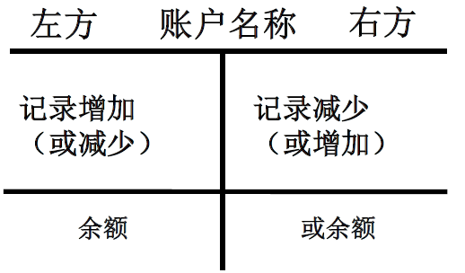
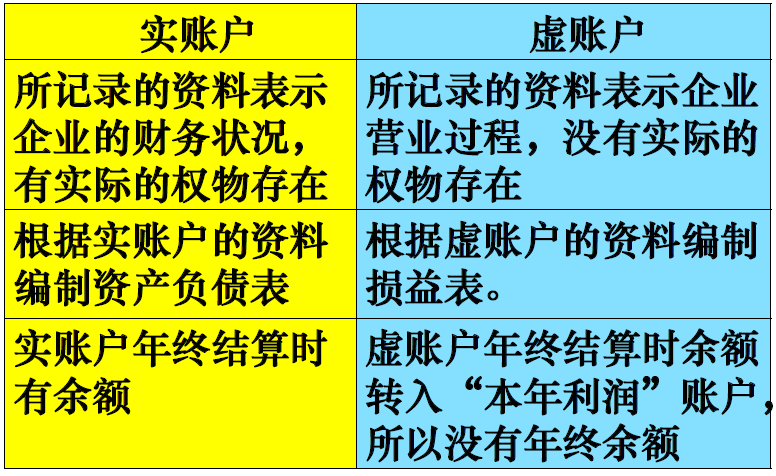
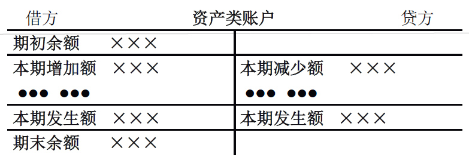
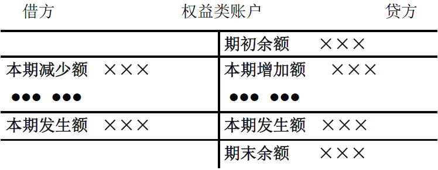
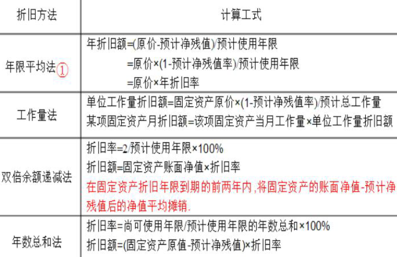
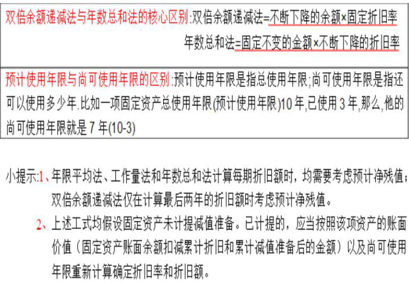

# 会计学原理
---
#### 名词解释内容

<table align='center'>
<tr>
<th align='center'>名词</th>
<th align='center'>含义</th>
</tr>
<tr>
<td align='center'>借贷记账法</td>
<td>是指以“借”“贷”为记账符号，反映各项会计要素增减变动情况的一种复式记账方法。它是目前世界各国通用的一种记账方法，也是我国企业法定的记账方法。</td>
</tr>
<tr>
<td align='center'>会计信息</td>
<td>又称为财务信息。是指企业从会计视角所揭示的<b>经济活动情况</b>。企业提供的信息主要有财务状况信息，经营成果信息和现金流量信息。</td>
</tr>
<tr>
<td align='center'>经济交易与事项</td>
<td>是从会计角度观察和把握企业经济活动的结果。经济交易是指企业与其他经济实体之间所发生的商品或劳务交换，资产转移，款项结算等经济活动。从现金流转的角度，包括收款、付款和转账交易与事项。</td>
</tr>
<tr>
<td align='center'>稳健性</td>
<td>也叫谨慎性原则。是指某些经济业务有几种不同会计处理方法和程序可供选择时，在不影响合理选择的前提下，应当尽可能选用对所有者权益产生影响最小的方法和程序进行会计处理。</td>
</tr>
<tr>
<td align='center'>利润</td>
<td>是企业一定会计期间的经营成果，是全部收入减去全部费用后的差额。</td>
</tr>
<tr>
<td align='center' rowspan=2>会计要素</td>
<td>指对会计对象按照其经济特征所作的分类，即将会计内容分解成若干个要素，统称为会计要素。</td>
</tr>
<tr><td>我国《企业会计准则》将企业会计要素分为资产、负债、所有者权益、收入、费用和利润。其中，资产、负债和所有者权益是反映<b>财务状况</b>的会计要素；收入、费用和利润是反映<b>经营成果</b>的会计要素。</td></tr>
<tr>
<td align='center'rowspan=2>会计确认</td>
<td >指对经济事项是否作为会计要素正式加以记录和报告所作的认定。包含初始确认、后续确认、终止确认。</td>
</tr>
<tr><td>会计确认的四个基本标准为可定义性、可计量性、相关性和可靠性。</td></tr>
<tr>
<td align='center'>会计科目</td>
<td>按一定标准对会计要素的内容进行分类的具体项目，在会计上被称为“会计科目”（简称“科目”）</td>
</tr>
<tr>
<td align='center'>会计分录</td>
<td>指针对每项经济交易与事项确定其应当登记的账户名称、借贷方向及其金额的书面记录。</td>
</tr>
<tr>
<td align='center' rowspan=2>会计主体</td>
<td>会计主体是指会计工作为其服务的特定单位或组织，是会计人员进行会计核算时采取的立场以及在空间范围上的界定。</td>
</tr>
<tr><td>会计主体既可是一个企业，也可是若干个企业组织起来的集团公司，既可以是法人，也可以是不具备法人资格的实体。</td></tr>
</table>

--- 
#### 简答题重点内容
1. 会计账户与会计科目之间的联系与区别

2. 所有者权益的特征

3. 收入确定的条件

4. 资产的特征

5. 试算平衡表的作用

6. 产品制造企业的主要经济业务有哪几种

$\rm{ANSWER}:$

1. **会计账户与会计科目之间的联系与区别**
    - 联系
（1）会计科目是设置账户的依据，会计科目是账户的名称
（2）会计科目界定账户记录的经济内容
（3）会计科目的分类也就是账户的分类
（4）我国会计实务中并未严格区分“会计科目”与“账户”的概念，两者甚至是相互混用的
     
    - 区别
（1）特征不同（静态与动态）
（2）形式不同
（3）作用不同
（4）制定权限不同
 
2. **所有者权益的特征**
   - 所有者投资所形成的资产可供企业长期使用，其出资额在企业依法登记后，不得随意抽回
   - 所有者投资所形成的资产是企业清偿债务的物质保证。
   - 所有者以其出资额享有获取企业利润的权利，与此同时，也以出资额承担企业的经营风险
 
3. **收入确定的条件**
    - 对于符合收入定义的项目，必须具备如下条件才能予以确认：
        - 企业履行了合同中的履约义务，即在客户取得相关商品控制权时确认收入。
        - 取得相关商品控制权，是指能够主导该商品的使用并从中获得几乎全部的经济利益。
 
1. **资产的特征**
    - 资产是指企业过去的交易或者事项形成的，由企业拥有或者控制的，预期会给企业带来经济利益的资源，包括各种财产、债权和其他权利。
    - 与该资源有关的经济利益很可能流入企业。
    - 该资源的成本或价值能够可靠地计量。
 
5. **试算平衡表的作用**
    - **验证会计记录下计算有无错误**
    各种经济业务发生后，企业通过记账凭证、分类账予以记载，但难免会发生错误，而通过试算平衡可以及时发现错误并予以更正。
    - **便于编制会计报表**
    试算表根据各分类账借贷余额汇总编制而成，依据试算表编制会计报表将比直接依据分类账来编制更为方便
    - **粗略显示财务状况和经营成果**
    试算表所列数据虽未经调整、结账等程序，但从此表也可以粗略了解企业的财务状况和经营成果
 
6. **产品制造企业的主要经济业务有哪几种**
    - 资金筹集的经济业务
    - 生产准备的经济业务
    - 产品生产的经济业务
    - 产品销售的经济业务
    - 财务成果计算与分配的经济业务

---
#### 计算题重点内容
1. [根据经济业务做会计分录](#entry) （重点：[会计要素分类](#class)）

2. [固定资产折旧的计算](#depreciation)

3. [财务分析指标的计算](#indices)

---
## 第一章 导论与会计概述
1. **四柱清册结算法**
- 始于**唐朝**，盛于**宋朝**
    > 旧管（上期结存）+新收（本期增加）= 开除（本期减少）+实在（本期结存）
2. 会计的存在使得人们之间、组织之间能够在一定程度上相互信任。**会计是一种低成本的信任机制**。
3. 封建社会的会计，以**会计专职人员**的出现和会计机构的产生为标志。
4. 近代会计以15世纪**复式记账法**的诞生为标志。
5. 现代会计以20世纪50年代**管理会计**的形成并与**财务会计**分离为标志
6. 龙门账
    > 进（全部收入）-缴（全部支出）= 存（全部资产）-该（全部负债）
7. **会计的职能**
- 分析职能
- 控制职能
- 决策职能
- 预测职能
- 监控器（监督职能）
- 显示与核算器（基本职能）
8. 会计目标
- 会计目标是指在一定社会经济环境下，人们通过会计实践活动所期望达到的要求和目的。

    - 决策有用学派：会计的目标是为会计信息使用者提供对他们决策有用的信息。
    - 受托责任学派：会计的目标是报告受托经济责任的履行情况。
9. 会计信息（Accounting Information）
- 又被称作财务信息（Financial Information）：是指企业从会计视角所揭示的经济活动情况，包括企业的财务状况、经营业绩和现金流量等。
- 会计信息的特征：
    - 以货币计量的价值
    - 综合性
    - 延续性
- 会计信息的质量特征：
    - 主要特征：
        - 可靠性
        - 可比性
    - 其他特征：
        - 相关性
        - 及时性
        - 重要性
        - 明晰性
        - 实质重于形式
        - 谨慎性：*宁可预计可能的损失，不可预计可能的收益*
- 会计信息的实现方式
<table>
<tr>
<td align='center' colspan=3>财务报告</td>
</tr>
<tr>
<td align='center' colspan=2>财报报表</td>
<td align='center'>
其他财务报告
</td>
</tr>
<tr>
<td align='center'>资产负债表</td>
<td align='center'>利润表</td>
<td align='center'>现金流量表</td>
</tr>
</table>

10. **会计的基本内容**
- 会计确认
- 会计计量（核心）
- 会计记录
- 会计报告
11. 道生一，一指“资本，钱”
一生二，二指资产的形态与来源，资产等于权益
二生三，三指资产等于债权人权益与所有者权益
三生万物，万物指资产、负债、所有者权益，再加上收入、费用、利润，一共六类会计要素
12. 会计要素可以相互转化，并始终平衡。**有借必有贷，借贷必相等**。

---
## 第二章 企业经济活动与会计要素
1. 广义上，**企业是一种经济资源的“配置器”**。现代产权理论则认为，企业是一系列**契约**的组合。
- 总结来看，企业是一种资金运动的动态体系。
2. **会计对象**
- 会计对象是**会计核算**和**会计监督**的内容，是企业以货币表现的经济业务，是企业再生产过程中的资金运动。
3. **资产**
- 资产是指企业过去的交易或者事项形成的，由企业拥有或者控制的，预期会给企业带来经济利益的**资源**。
- 流动资产：
    - 库存现金
    - 银行存款
    - 应收账款
    - 应收票据
    - 原材料
    - 库存商品
    - 预付账款
- 非流动资产
    - 长期投资
    - 固定资产
    - 无形资产
4. **负债**
- 负债是指企业过去的交易或者事项形成的，预期会导致经济利益流出企业的**现时义务**。
<ol type='a'>
<li>流动负债<ul><li>短期借款</li><li>应付及预收款项
<ul><li>应付账款</li><li>预收账款</li><li>预提费用</li><li>应交税金</li><li>……</li></ul></li></ul></li>
<li>长期负债<ul><li>长期借款</li><li><b>应付债券</b></li><li>长期应付款</li></ul></li>
</ol>

- 另一种分类方式
<table>
<tr><th>类别名称</th><th>项目</th></tr>
<tr><td  align='center' rowspan=3>营业性负债</td><td align='center'>应付账款</td></tr>
<tr><td align='center'>应付票据</td></tr>
<tr><td align='center'>应付职工薪酬</td></tr>
<tr><td  align='center' rowspan=2>融资性负债</td><td align='center'>短期借款</td></tr>
<tr><td align='center'>长期借款</td></tr>
<tr><td  align='center' rowspan=2>分配性负债</td><td align='center'>应付股利</td></tr>
<tr><td align='center'>应交所得税</td></tr>
</table>

5. **所有者权益**
- 所有者权益是指企业扣除负债后，由所有者享有的**剩余权益**。包括实收资本（或股本）、资本公积、盈余公积和未分配利润。
- **所有者权益 $=$ 资产 $-$ 负债**
- 所有者投入
    - 实收资本：投资这直接投入部分
    - 资本公积：与经营活动无关的资本增值，如接收捐赠
- 部分利得与损失
- 利润留存
    - 盈余公积：从实现的利润中留存企业的部分
    - 未分配利润：已经实现但尚未分配的利润
6. **收入**
- 收入是指企业在日常活动中形成的、会导致**所有者权益**增加的、与所有者投入资本无关的**经济利益的总收入**。
- 主营业务收入 （营业收入）
- 其他业务收入 （营业收入）
- 投资收益
7. **费用**
- 费用是指企业在日常活动中发生的，会导致**所有者权益**减少的，与向所有者分配利润无关的**经济利益的总流出**。
- 主营业务成本
- 其他业务成本
- 营业税金及附加
- 销售费用
- 管理费用
- 财务费用
    >费用不能对象化，当期补偿，遵循配比原则；
    >成本可以对象化，补偿可能在当期或者以后。
    >**成本是对象化了的费用**
8. **利润**
- 利润是企业一定会计期间的经营成果，是全部收入减去全部费用后的差额。
- **利润 $=$ 收入 $-$ 费用**
9. 会计计量
- 会计计量是指为了将符合确认条件的会计要素登记入账，并列于财务报表而确定其金额的过程。
10. 历史成本（Historical Cost）
- 也称作“实际成本”，是指企业为了取得某项资产并使其达到可供使用状态所实际发生的全部支出。
- 历史成本是**会计计量**中**最重要**和**最基本**的计量属性，一直是国际会计惯例中的**基础性计价标准**。
11. 重置成本（Replacement Cost）
- 也称作“现行成本（Current Cost）”或“现时投入成本”，是指在当前生产条件和市场供求状态下，重新购置某项相同或类似特有资产所需发生的全部支出。
12. 可变现净值（Net Realizable Value）
- 称作“预期脱手价值（Expected Exit Value）”，是指资产按照其正常对外销售所能收到现金或者现金等价物的金额，扣减该资产至完工时估计将要发生的成本、估计的销售费用以及相关税费后的金额。
13. 现值（Present Value）
- 是“未来现金流量的现值”的简称，是指预计从资产持续使用和最终处置中所产生的未来净现金流入量的折现金额。
- 此种方法需要知道一个比较客观的折现率。
14. 公允价值（Fair Value）
- 是指市场参与者在计量日发生的有序交易中，出售资产所能收到或者转移负债所需支付的价格。
- 在实务中，一般**对于金融市场的许多金融产品采用公允价值计量**。
15. **会计等式**
- 静态会计等式： **资产 $=$ 负债 $+$ 所有者权益**
- 动态会计等式： **收入 $-$ 费用 $=$ 利润**
- 综合会计等式：
 **资产 $=$ 负债 $+$ 所有者权益 $+$ 收入 $-$ 费用 $=$ 负债 $+$ 所有者权益 $+$ 利润**
 16. 经济交易（Transactions）、事项（Events）是从会计角度观察和把握企业经济活动的结果。

 ---
## 第三章 账户与复式记账

 1. 会计科目
 - 按一定标准对会计要素的内容进行分类的具体项目，在会计上被称为“会计科目”（简称“科目”）
 2. 设置会计科目的原则
 - 简明性、代表性、一致性、互斥性、灵活性
 3. 会计科目大类排列
 - 资产类、负债类、所有者权益类、成本类、损益类
 - **资产、负债类**科目有两种不同排列方式
    - 流动性
    - 固定性
4. 会计科目的编号
- 总分类会计科目的编号通常采用四位数字，企业设置明细分类科目时，其编号应在右边再增加两位数字。
- 第一位数字表示会计科目的大类别：
    - 1表示资产类，
    - 2表示负债类，
    - 3表示所有者权益类，
    - 4表示成本类，
    - 5表示损益类。
- 第二位数字表示小类。
- 第三、四位数字表示小类下的各会计科目的序号。
5. 会计账户
- 根据会计科目开设的，具有一定结构，用来**分类、连续、系统地**记录各项经济业务，**反映各个会计要素增减变化情况及其结果**的一种工具。
6. 账户的设置
- 账户应根据**会计科目**的分类来设置
    >**A. 根据经济内容不同**
    >- 资产类科目→资产类账户
    >- 负债类科目→负债类账户
    >- 所有者权益类科目→所有者权益类账户
    >- 成本类科目→成本类账户
    >- 损益类科目→损益类账户

    >**B. 根据提供核算指标的不同层次**
7. 账户的基本结构

日期|凭证号数|摘要|借方|贷方|金额
:---:|:---:|:---:|:---:|:---:|:---:
$*$|$*$ |$*$ |$*$ |$*$ |$*$ |

- T形账户

8. 账户提供的会计信息
- 期初余额和期末余额
- 期末余额 $=$ 期初余额 $+$ 本期增加发生额 $-$ 本期减少发生额
9. 实账户与虚账户
- 实账户
    - 资产类账户
    - 负债类账户
    - 所有者权益
- 虚账户
    - 成本类账户
    - 损益类账户
- 区别

10. 会计科目与账户的基本关系
- 会计要素
会计化了的各项经济活动
 
    - 会计账户
    对会计要素的分类反映
     
        - 会计科目
        账户的名称
11. 记账方法
- 单式记账
单式记账法是指对发生经济业务之后所发生的会计要素的增减变动一般只在一个账户中记一笔账的方法。
 
- 复式记账
对每项经济业务都必须在两个或两个以上的相互联系的账户中以相等的金额进行登记的方法。
    - **借贷记账**
    - 增减记账
    - 收付记账
12. 借贷记账法
- 借贷记账法产生于12世纪的意大利
- 记账符号
    - “借”和“贷”表示账户的两个固定部分，用来指明记入账户金额的方向。
    - 反映会计要素的增减变化，表示资金运动的来龙去脉，指明账户的对应关系。
    - 可用以判断账户的性质
- 账户结构
    - 账户的结构取决于账户的性质
- 记账规则
    **资产 $+$ 费用 $=$ 负债 $+$ 所有者权益 $+$ 收入**
    **资产 $=$ 负债 $+$ 所有者权益 $+$ 利润**
    - 等式左侧增加记借方，减少记贷方
    - 等式右侧增加记贷方，减少记借方
     
    - 资产类账户：
    
    - 权益类账户：
    
13. 会计分录
- 会计分录（Entry）是指针对每项经济交易与事项确定其应当登记的账户名称、借贷方向及其金额的书面记录。
- 书写会计分录的格式：
    - **先借后贷**，借和贷要**分行写**，并且贷方的符号、科目与金额的数字都错开
    - 同行文字与金额的数字应适当**错开位置**
    - 复合会计分录的借方或贷方的文字和金额数字必须分别对齐
    
    - 一般会计分录采用**一借一贷、一借多贷、一贷多借**三种类别，**不采用**多借多贷的复杂分录。
14. 试算平衡
- 根据**资产 $=$ 负债 $+$ 所有者权益**的平衡关系，按照记账规则的要求，对本期账户记录进行汇总计算和比较，以检查和验证账户记录正确性与完整性。（俗称轧账）
15. **会计要素分类**
    - **资产**
        - 现金及各种存款
        - 交易性金融资产（*购买股票*）
        - 长期股权投资
        - 应收及预付款项、存货、其他应收款等
        - 固定资产
        - 无形资产（*专利*）
        - 在建工程、工程物资、开发支出等
        - 在途物资
        - 原材料
    - **负债**
        - 短期借款
        - 应付票据、已付账款
        - 应付职工薪酬
        - 预收账款
        - 应付股利、应付利息
        - 应交税费
        - 其他应付款（*已经享用但还未支付的服务等费用*）
        - 长期借款
        - 应付债券等
    - **所有者权益**
        - 实收资本
        - 资本公积：资本（或股本）溢价等
        - 盈余公积
        - 未分配利润
        - 本年利润
    - **收入**
        - 主营业务收入
        - 其他业务收入
    - **费用**
        - 营业成本：主营业务成本、其他业务成本（*税金及附加*）
        - 期间费用：销售费用、管理费用、财务费用（*利息支出*）
    - **利润**
        - 营业利润
        - 利润总额
        - 净利润
---
## 第五章 会计确认与计量
1. 会计确认
- 会计确认（Accounting Recognition）, 是指对经济事项是否作为会计要素正式加以记录和报告所作的认定。包括*初始确认、后续确认、终止确认*。
2. 会计确认的基本标准
- **可定义性**
    - 指被确认的项目必须符合某一会计要素的定义。
- **可计量性**
    - 指被确认的项目应当具有可靠的计量属性（计价标准）并能客观地加以计量。
- **可靠性**
    - 企业应当以实际发生的交易或事项为依据进行会计确认、计量和报告，如实反映符合确认和计量要求的各项会计要素及其他相关信息，保证会计信息真实可靠，内容完整。
- **相关性**
    - 企业提供的会计信息应当与财务会计报告使用者的经济决策需要相关，有助于财务会计报告使用者对企业过去、现在或将来的情况做出评价或者预测。
3. 会计假设
- 会计假设（Accounting Assumption），也称为会计假定，它是进行日常会计处理、提供信息使用者所需会计信息的必要前提。
- **四大基本假设**：
    - **会计主体**
    - **持续经营**
    - **会计分期**
    - **货币计量**
- 在《企业会计准则》中，规定我国企业的会计期间**按年度划分**，以日历年度为一个会计年度，即*从每年1月1日至12月31日为一个会计年度*。
- 会计法规定**会计核算以人民币为记账本位币**，*业务收支以人民币以外的货币为主的单位，可以选定其中一种作为记账本位币*，但是编报的**财务会计报表应当折算为人民币**。
4. 权责发生制 (Accrual Basis) 与收付实现制 (Cash Basis)
- 权责发生制与收付实现制是**确认交易或事项**（特别是与收入和费用有关事项）的两种基础。
- **权责发生制基础**：
    - 确认收入和费用的标准：**应收应付**。
    以权利已经形成或义务已经发生（责任应当承担）为确认收入和费用的标准。
    - **适用于制造业企业等**。
- **收付实现制基础**：
    - 确认收入和费用的标准：**实收实付**。
    以货币资金的实际收付作为惟一确认标准。
    - **适用于行政、事业单位等**。
5. 会计计量
- 会计计量（Accounting Measurement）是对经济交易与事项的价值数量关系进行计算和衡量的过程，其实质是以**数量**（主要是以货币表示的价值量）关系揭示经济事项之间的内在联系。
- **会计计量是会计的核心内容**，贯穿于财务会计过程之始终。
- 计量单位：货币
6. 会计要素确认与计量的要求
    - 划分收益性支出与资本性支出：
        - 凡支出的效益仅与本会计年度（或一个营业周期）有关的应确认为**收益性支出**。
        - 凡支出的效益与几个会计年度（或几个营业周期）有关的应确认为**资本性支出**。
    - 收入与费用配比：
        - 企业同一会计期间内的各项收入和与其相关的成本、费用，应当在该会计期间内确认，并相互配比。
        - 收入与其相关的成本、费用应当相互配比。
    - 历史成本计量：
        - 企业的各项财产物资应当按取得（购买、生产或建造等）时发生的实际成本计价。
        - 当财产物资的市价变动时，除国家另有规定外，企业一律不得自行调整其账面价值。
7. 永续盘存制 (Perpetual Inventory System) 与定期盘存制 (Periodic Inventory System)
- 永续盘存制与定期盘存制是计算期末存货结存的两种方法
- **永续盘存制**：
    - 也被称为“账面盘存制”，是通过设置存货（如材料、产成品或商品等）明细账户，逐日或逐笔记录存货的收入和发出数，并随时记列其结存（持有）数量的方法。
    - 需要定期或不定期地对实物进行实地盘点，以便核对存货的账面数（账存数）和实有数是否相符。
- **定期盘存制**：
    - 也被称为“实地盘存制”，是在期末通过现场（实地）盘点实物确定存货的结存（持有）数量，并据以计算存货耗用（或销售）数量的方法。
    - 平时对存货只在明细账户中记录其购入或收进数，不记录其发出数，期末通过盘点实物确定结存数量后，据以计算存货耗用数量。
- **对比**：
    - **永续盘存制**对存货控制和安全性方面有优势，但核算工作量大。
    - **定期盘存制**一般适用于价值低、品种杂、交易极其频繁的存货和损耗大、数量不稳定的鲜活商品。
8. 期末持有存货与期内耗用存货的计价方法
- **个别计价法**
成本流动与存货实物流动情形完全相同，因此，所确定的本期耗用（或销售）存货成本和期末持有存货成本价值都比较准确。
- **先进先出法**
大多数企业都是将先取得的存货先行耗用或者出售，特别是容易腐坏或变质的商品，FIFO的成本假设与存货实际物流情形基本相符。
- **后进先出法**
只是会计上计算存货成本的一种假设，存货实际流动不是后进先出的企业也可以采用。
- **加权平均法**
期末持有存货成本=期末持有存货数量×加权平均单位成本
- **成本与市价孰低法**
9. 固定资产折旧的价值计量
- 折旧（Depreciation），指固定资产在使用过程中由于损耗而逐步转移掉的那部分价值。
- 固定资产应计提折旧总额 $=$ 固定资产原值 $-$ （预计残值 $-$ 预计清理费用）
- 预计残值 $-$ 预计清理费用 $=$ 预计净残值
- **方法**：
    - **使用年限法**
    - **工作量平均折旧法**
    - **年数总和法**
    - **双倍余额递减法**
 

- **当月购买的机器设备、固定资产当月不计提折旧，从下个月开始计提折旧**。

---
## 第六章 会计凭证和账簿
1. 会计凭证
- 是用来记载经济交易与事项的具体内容、作为会计记录依据的书面证明文件。
- 会计凭证按其**填制程序和用途不同**，可分为**原始凭证**和**记账凭证**
 
- **原始凭证**
    - 由经济交易与事项的**经办人员**填制或取得，其用来作为编制会计分录的依据。
    - 原始凭证按**来源**分类可分为**外来原始凭证**（发票、银行结算凭证、飞机票）和**自制原始凭证**（领料单、收料单、工资发放明细表、折旧表）
    - 原始凭证按**填制方法**分类可分为**一次凭证**和**累计凭证**
 
- **记账凭证**（又称**传票**）
    - 由**企业会计人员**根据所取得的原始凭证填制，其用来作为登记账户（即账户记录）的依据。
    - 记账凭证包含**收款凭证、付款凭证、转账凭证**
 
- **作用**
    - 审核经济业务
    - 作为记账依据
    - 加强经济责任
2. 会计账簿
- 简称“账簿”或“账”，是以会计凭证为依据，连续、系统、分类地记录各种经济交易与事项的簿籍。
- 按用途分
    - 序时账
        - 普通日记账
        - 特种日记账
    - 分类账
        - 总分类账
        - 明细分类账
    - 备查账
    - 日记总账
- 按外表形式分
    - 订本式
    - 活页式
    - 卡片式
- 按账页格式分
    - 三栏式
    - 多栏式
    - 数量金额式
3. 期末账项调整
- 期末账项调整就是按照**权责发生制**原则，对部分没有明显交易行为却影响本期损益的一些隐含事项进行调整的行为
<ul>
<li>期末账项调整</li>
 
<ul>
<li>基本调整事项</li>
<ul>
<li>应计项目</li>
<ol type='i'>
<li>应计收入 <b>已实现，未到账</b></li>
<li>应计费用 <b>已发生，未支付</b></li>
</ol>
<li>递延项目</li>
<ol type='i'>
<li>递延收入 <b>未实现，已到账</b></li>
<li>递延费用 <b>未发生，已支付</b></li>
</ol>
</ul>
<li>期末其他账项调整</li>
<ul>
<li>计提累计折旧</li>
<li>摊销无形资产</li>
<li>计提各种准备金</li>
</ul>
</ul>
</ul>

4. 错账的查找方法
- **原始凭证** $\leftrightarrows$ **记账凭证** $\leftrightarrows$ **会计账簿** $\leftrightarrows$ **试算平衡**
- 全面检查法
    - 正查法
    - 逆查法
- 个别检查法
    - 差数法（漏记）
    - 除2法（记错借贷方向）
    - 除9法（数字颠倒、小数点点错位置或者数字位移）
5. 错账的更正方法
- 划线更正法（又称直接更正法）（**结账以前**）
- 红字更正法（**错误 $>$ 应计数**）
- 补充登记法（**错误 $<$ 应计数**）
6. 结账
- 指会计期末结算、登记每个账户本期发生额和期末余额的账务处理工作，包括虚账户的结清和实账户的结转，为编制财务报表做好准备。
7. 对账
- **账证核对**
账簿与记账凭证及其所附的原始凭证进行核对
- **账账核对**
各种账簿之间的有关数字相互核对
- **账实核对**
各种账簿记录与各项财产物资、货币资金等实有数核对

---
## 第七章 财务报表的编制
> 财务会计报告分为年度、半年度、季度和月度财务会计报告。
年度和半年度财务会计报告包括：**会计报表、会计报表附注、财务情况说明书**，季度和月度财务会计报告通常只需要编制会计报表即可。

- 财务会计报表，包括**资产负债表、利润表、现金流量表、所有者权益变动表和有关附表**等。
 
- **“一张照片 $+$ 两部电影”**
- 资产负债表
**资产 $=$ 负债 $+$ 所有者权益**
反映企业在**某一特定时点**上的**财务状况**
- 利润表
**利润 $=$ 收入 $-$ 费用**
反映企业在**某一特定时期**内的**经营成果**
- 现金流量表
**本期结余 $=$ 上期结余 $+$ 本期流入 $-$ 本期流出**
反映企业在**某一特定时期**内的**现金流入和流出状况**
---
## 第八章 财务会计报表的基本分析
> 财务报表分析是通过对财务数据和相关信息的汇总、计算、对比和说明，借以揭示和评价公司的财务状况、经营成果、现金流量和公司风险等情况，为报表使用者进行投资、筹资和经营决策提供财务信息。
1. 财务分析的方法
- **比较分析法**（又称横向分析）是指前后两期财务报表间相同项目变化的比较分析。
- **结构百分比分析**（又称纵向分析）是指同一期间财务报表中不同项目间的比较与分析，主要是通过编制百分比报表进行分析。
- **趋势百分比分析**将连续多年的财务报表的数据，集中在一起，选择其中某一年份作为基期，计算每一期间各项目对基期同一项目的百分比或指数。
- **财务比率分析**利用会计报表上的相关会计数据计算出各种财务比率指标进行分析。
- **因素分析**利用各种因素之间的数量依存关系 ，通过因素替代，从数额上测定各因素变动对某项综合性经济指标的影响程度。
2. <b>财务分析指标</b>
<ol type='i'>
<li><b>盈利能力分析</b></li>
<li><b>经营能力分析</b></li>
<li><b>偿债能力分析</b></li>
</ol>

3. 盈利能力分析
    > 盈利能力分析是财务比率分析的**核心**，主要用于分析公司收入与成本、收益和投资之间的关系。
- 反映公司盈利能力的指标
    - 以**资产或股权**为基础的收益率指标
        - 净资产收益率
        - 总资产收益率
        - 每股收益，每股净资产，市盈率
    - 以**销售**为基础的盈利指标
        - 经营毛利率
        - 经营利润率

- **净资产收益率(*return of equity*, ROE)**
    - 含义：公司的净收益与股东权益平均占用额的比率，反映股东投资收益水平，**是公司盈利能力指标的核心**。
    - 计算公式：$$ROE=\frac{净利润}{股东权益平均占用额}\times100\%$$
    其中，$$股东权益平均占用额=\frac{1}{2}*(股东权益年初余额+股东权益年末余额)$$
    - 净资产收益率越高，**公司股东投资获取收益的能力越强**。
- **总资产收益率(*return of assets*, ROA)**
    - 含义：公司在一定时期创造的收益与资产总额的比率 ，表明公司全部资产的获利水平。
    - 根据分析的角度（采取的利润指标）不同，有以下三种计算方法：
        - 息税前收益
        $$ROA=\frac{息税前收益}{总资产平均占用额}\times100\%$$
        - 税前收益
        $$ROA=\frac{税前收益}{总资产平均占用额}\times100\%$$
        - 净收益
        $$ROA=\frac{净收益}{总资产平均占用额}\times100\%$$
    - 总资产收益率越高，表明公司的资产利用效益越好，整个公司盈利能力越强，**经营管理水平越高**。
- **销售利润率**
    - 含义：公司的**利润**与销售净收入的比率，用来衡量公司销售收入的获利水平。
    - 计算公式：
    $$销售利润率=\frac{利润}{销售净收入}\times100\%$$
    - 销售利润率越高，**公司发展潜力越大**，从而盈利能力越强。
- **每股收益(*earning per share*, EPS)**
    - 计算公式：
    $$EPS=\frac{净利润-优先股股利}{发行在外的普通股加权平均数}$$
    - EPS表明股份公司发行在外的每股普通股股票所获得的利润，其说明**股份公司的盈利能力大小**。
- **每股净资产**
    - 计算公式：
    $$每股净资产=\frac{年末股东权益}{年末普通股数}$$
    - 公司的每股净资产比率越大，表明公司的股票价值越高。
4. 经营能力分析
    > 资金运营能力是指企业管理层合理、高效地利用经营资金的能力。
- **应收账款周转率**
    - 含义：公司一定时期内赊销收入净额与应收账款平均余额的比率，是考核应收账款变现能力的重要指标。
    - 计算公式：
    $$应收账款周转率=\frac{赊销收入净额}{应收账款平均余额}$$
    其中：
    $$赊销收入净额=销售收入-现销收入-销售退回、折扣、折让$$
    $$应收账款平均余额=\frac{1}{2}*(应收账款年初余额+应收账款年末余额)$$
    - 应收账款周转率反映了应收账款转化为货币资本的平均次数。一般来说，应收账款周转率越高，**公司收账速度快、坏账损失少**。
- **应收账款平均周转天数**
    - 计算公式：
    $$应收账款平均周转天数=\frac{日历天数}{应收账款周转率}$$
    - 应收账款周转天数**越短越好**。
- **存货周转率**
    - 含义：公司一定时期内销售成本与存货平均余额的比率，是反映存货周转速度的指标。
    - 计算公式：
    $$存货周转率=\frac{销售成本}{存货平均余额}$$
    其中，$$存货平均余额=\frac{1}{2}*(存货年初余额+存货年末余额)$$
    - 存货周转率越高，说明存货在公司停留的时间越短，存货占用的资本就越少，**公司的存货管理水平越高**。
- **总资产周转率**
    - 含义：总资产周转率说明企业总资产的利用效率。如果该比率较低，说明企业利用其资产进行经营活动的效率较差。
    - 计算公式：
    $$总资产周转率=\frac{销售收入净额}{总资产平均总额}$$
5. 偿债能力分析
    > 主要用于评价公司按时履行其财务义务的能力。
- 反映偿债能力的指标主要包括流动性比率和财务杠杆比率两大类
    - 流动性比率
        - 流动比率
        - 速动比率
        - 现金比率
    - 财务杠杆比率
        - 负债比率（资产负债率）
        - 股东权益比率
        - 权益乘数
        - 负债与股东权益比率
        - 利息保障倍数
- **流动比率**
    - 含义：公司流动资产“包含”流动负债的倍数，用以衡量公司的短期偿债能力。
    - 计算公式：
    $$流动比率=\frac{流动资产}{流动负债}$$
    - 通常，从**债权人**的角度看，流动比率越高，公司短期偿债能力越强，债权人的权益越有保障；但从**公司经营**角度看，过高的流动比率通常意味着公司流动资产占用资金较多，会造成公司机会成本的增加和获利能力的降低。
    - **一般要求流动比率保持在2：1的水平，即200%的水平**。
- **速动比率**
    - 含义：速动资产与流动负债的比率，能够更加准确、可靠地评价公司资产的流动性及偿还短期负债的能力。
    - 计算公式：$$速动比率=\frac{速动资产}{流动负债}$$
    - 速动比率越高，表明公司**偿还债务**的能力越强。
    - 一般地，速动比率保持在1：1的水平，即100%的水平。
- **资产负债率**
    - 含义：负债总额对资产总额的比率，反映公司全部负债（流动负债和长期负债）在公司资产总额中所占的比率。
    - 计算公式：
    $$负债比率=\frac{负债总额}{资产总额}$$
    - 该比率越高，表明**公司偿还债务的能力越差**，反之，则偿还能力越强。
    - 通常，资产负债率不应高于50%；当资产负债率大于100%时，表明公司资不抵债。
- **股东权益比率**
    - 含义：所有者权益与资产总额的比率，衡量股东投入资本在全部资本中所占的比重 。
    - 计算公式：
    $$股东权益比率=\frac{股东权益}{资产总额}$$
    - 股东权益比率与负债比率是从两个不同侧面反映公司的**长期财务状况**。
    - 股权比率越大，负债比率就越小，**公司的财务风险也越小**。
- **利息保障倍数**
    - 含义：公司一定时期息税前利润与利息费用的比率，主要用于分析公司在一定盈利水平下支付债务利息的能力。
    - 计算公式：
    $$利息保障倍数=\frac{息税前收益}{利息费用}=\frac{税前收益+利息费用}{利息费用}$$
    - 这一比率越高，说明公司的利润为支付债务利息提供的保障程度越高；如果利息保障倍数较低，则说明公司的利润难以为支付利息提供充分保障，就会使公司失去对债权人的吸引力。
    - **该比率至少应大于1，否则公司能就不能举债经营**。
    - **考核标准**：从连续几年计算的利息保障倍数中选择**最低**的会计年度考核。