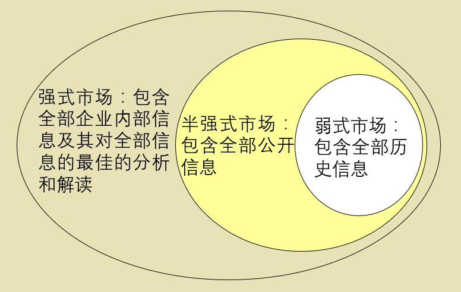
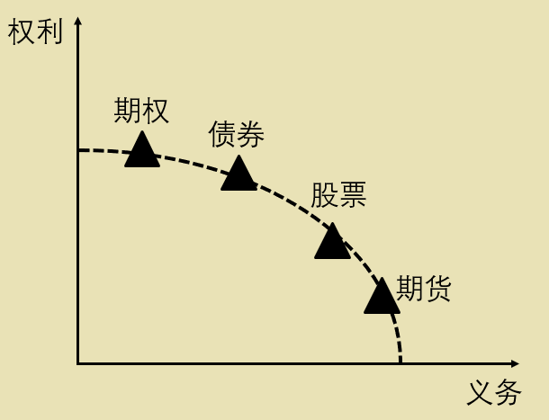
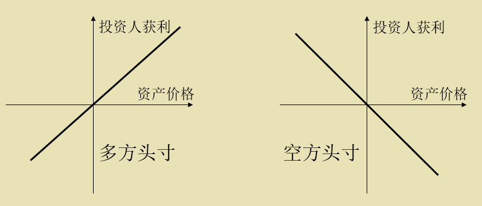
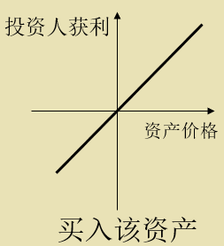
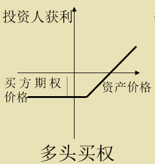
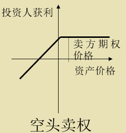
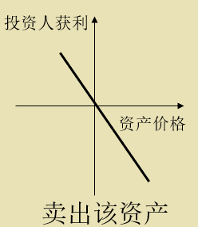
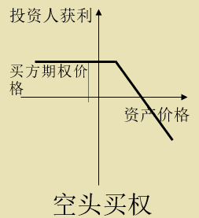
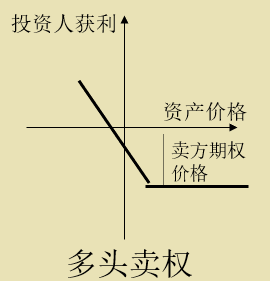

#### 计算题
1. 马科威次证券组合理论
- 在金融市场上，衡量某项资产的风险和回报的指标分别是：该资产价格的标准差($\sigma$)和预期收益($r$)。 
- 如果我们用资产A和B组合去形成C，那么资产C的风险和回报的计算方法就是：
- $\rho$为相关系数。

$$r_c=x_ar_a+x_br_b$$

$$\sigma_c^2=(x_a\sigma_a)^2+(x_b\sigma_b)^2+2(\rho x_ax_b\sigma_a\sigma_b)$$

2. [资产定价](#zcdj)
3. [债券风险](#fxgl)
4. [期权定价](#qqdj)

#### 名词解释
1. 套利
> **套利**是指人们利用在金融市场上暂时存在的不合理的价格关系，通过同时买进或者卖出相同的或者是相关的金融工具，从中无风险地赚取价格差异的交易行为。
2. [有效金融市场假设](#assumption)
3. 无套利条件
> 资产未来的现金流量能够被其他资产组合所完全复制，同时用于复制的组合的价格应该与原资产价格基本一致。[（数学形式）](#no_risk_cond)
4. [期货交易](#qhjy)
> “期货”是指以合约形式确定下来的，在未来某一特定日期进行交割（购买或出售）的某种实物商品或金融资产的交易。
5. [远期交易](#yqjy)
> 远期交易在买卖成交时以及合约存续期间都不发生现金流动，双方只是将交易的各项条件（如交易标的物的质量、交易的数量、交易的价格以及交割结算日等）用合约的形式确定下来，而实际交割则在预约的将来某一个特定日期进行。它是人们最经常使用的一种套期保值的工具。
6. 头寸
> 头寸 (position) 是投资人根据其对某一项资产未来价值走势的判断而持有的买入或者卖出该资产的立场。
7. [久期](#jq)
8. 期权
> 期权(Option)是以事先确定的价格，允许投资人在未来一段时间内买入或者卖出某项资产的权力。
---
## 第一章 金融工程学导论
1. 金融学是关于“资产”、“预期”、“未来”的学科。金融学认为资产的价格由该资产的预期收益与风险决定，而与“供求关系”、“资金成本”、“历史数据”和“统计规律”无关。
2. 金融工程学是帮助人们在繁杂的金融市场中找到解决金融问题的方法论，其目的只有一个：**创造价值**。
3. 梅森(Scott Mason)和莫顿等人将金融工程分为5个步骤：
    - **诊断 Diagnosis**
    - **分析 Analysis**
    - **生产 Generate**
    - **定价 Valuation**
    - **修正 Customize**
4. 金融工程学的三个基本要素：**不确定性 (uncertainty)、信息 (information)、能力 (resource)**。
5. 金融工程学的三个手段：**发现价值、为其他人创造价值提供保障、创造价值**。
6. 金融工程学现实的应用领域：**风险管理、资产定价、投资管理**。
---
## 第二章 金融市场
#### 有效金融市场假设
1. **金融市场帮助人们建立一种对于未来某项资产的预期**。这种对于未来的预期决定了人们当前的买卖行为和投资决策，也就决定了某项资产当前的市场价格。**这种预期通过金融市场传递给所有投资人**。
2. 解决“三个和尚没水喝”的金融学方案：
    > 如果我们能够帮助这三个和尚建立一种预期：未来出现的第四个和尚或者其他香客将从他们储蓄的水池中买水喝，他们就有可能以劳动力作为投入形成一种挑水机制，这种机制是靠预期来维持的，即：**他们都预期可以按照投入劳动力的比例，从卖水的收入中获得分红**。

3. 投资人对某项资产的**预期决定**了该资产在金融市场上的**价值**。
4. “一价原理”的无套利均衡思想：
    > 假设某项金融资产的当前价格是$P$，市场上对该资产判断在一年内要升值为$P_1$的概率为$t$，相应地，该项资产会贬值为$P_2$的概率为$(1-t)$。假设市场上一年期无风险利率为$r$，则有：

    $$r=P_1 t+P_2 (1-t)$$

    $$t\equiv (\frac{1}{2}+\lambda)$$
    > 其中，$\lambda$是持有任何一项金融资产的风险补偿。投资人之间的分歧$(P_1-P_2)$越小，该项资产的价格就越容易形成。
5. 现货市场的供求均衡并不能使一项资产形成稳定的市场价格，只有等到看跌和看涨的交易双方对预期价格实现均衡，才能形成资产价格。
6. **金融市场和商品市场完全不同**，绝对不能用经济学中描写商品市场的概念（如供需关系）来解释资产价格的形成机制。
7. <b>有效金融市场假设 (efficient financial market assumption)</b>
    > 在一个有效金融市场上，以当时的市场价格简单地买入或者卖出一项金融资产，并不能够使投资人实现任何无风险套利的利润。
8. 有效金融市场假设的基础是“**无套利均衡 (no risk free arbitrage)**”。
    > 无套利条件可以表示为：

    $$|\mathrm{payoff} (X_t - R_t)| < TC$$

    > 其中，$X_t$是原资产（或者资产组合），$R_t$表示复制资产，$TC$表示买入复制的组合和卖出原资产$X_t$（或者买入原资产，卖出复制资产的组合的反向操作）的净交易成本。
9. **只有在无套利均衡的前提下**，金融市场才能根据一项资产的预期收益和风险来确定其价值。且**在相同收益条件下，高风险资产的价格就会较低**；**在相同风险条件下，高收益资产的价格就会较高**。
10. **有效金融市场的一条重要定理**：
在有效金融市场上，市场预期是基于当前所有信息以及对历史规律的最佳认识的基础上，对未来做出的最优预期。这种最优预期体现为金融市场上的**当前价格**。
11. 有效金融市场的三种类型

12. **有效金融市场假设的推论**：
    - **市场没有记忆**，历史数据对预测未来市场价格走势毫无用处，分析股票历史走势的努力是徒劳的。
    - **相信市场价格**，市场能够充分地吸收任何公开的和企业内部的信息，并将这些信息可能造成的影响通过价格变动的方式表达出来。
    - **市场只对新信息作出反应**，成熟市场对新信息的反应更为敏感。
    - **市场价格的随机性**。
13. [金发女郎的困惑（百度文库）](https://wenku.baidu.com/view/3e80118683d049649b665890.html)
14. **金融市场的有效性和投资人的理性无关**
    > **格罗斯曼——斯蒂格利茨定理 (Grossman-Stiglitz theorem)**
    > 在有效金融市场上，具备充分信息和分析能力的“理性”投资人所获得的回报和那些不具备充分信息而又缺乏分析能力的“非理性”投资人所获得的回报是相同的。即：**投资人所掌握的知识、能力和信息与投资人所取得的收益无关**。
15. “我们并不掌握真理，我们所掌握的只是那些还没有被证明为错误的东西”
#### 资产价格的变化
1. 在有金融市场假设的前提下，我们可以认为资产的价格符合**马尔可夫过程 (Markov process)**。常用的马尔可夫过程有三种：**维纳过程、一般维纳过程和Ito过程**。
    - 维纳过程（布朗运动）

    $$\Delta S=\sigma \varepsilon \sqrt{\Delta t}$$

    $$\mathrm{d} S=\sigma \varepsilon \sqrt{\mathrm{d} t}$$

    - 一般维纳过程
    
    $$\Delta S=\alpha \Delta t+\sigma \varepsilon \sqrt{\Delta t}$$

    $$\mathrm{d} S=\alpha \mathrm{d}t+\sigma \varepsilon \sqrt{\mathrm{d} t}$$

    - Ito过程（几何布朗运动）

    $$\frac{\mathrm{d}S}{S}=\mu\mathrm{d}t+\sigma\varepsilon \sqrt{\mathrm{d} t}$$

    $$\mathrm{d}S=\mu S\mathrm{d}t+\sigma S\varepsilon \sqrt{\mathrm{d} t}$$

    - 资产价格的变化是资产价格和时间的函数。Ito表达式的第一部分$\mu S\mathrm{d}t$是一个常数，第二部分$\sigma\varepsilon \sqrt{\mathrm{d} t}$是一个随机过程。

 

符号|含义|备注
:---:|:---:|:---:
$S$|资产价格||
$t$|时间|
$\varepsilon$|随机抽样|$\varepsilon \sim N(0,1)$
$\sigma$|按照年率计算的$\Delta S$的标准差|
$\alpha$|漂移量（一项资产的预期收益）|
$\mu$|预期收益率|
$\frac{\mathrm{d}S}{S}$|一项资产的收益率|$\frac{\mathrm{d}S}{S}\sim N(\mu\mathrm{d}t,\sigma\sqrt{\mathrm{d} t})$
#### 米勒——莫迪利亚尼定理
1. $\mathrm{M}\&\mathrm{M}$定理
    > 在不考虑公司所得税，且企业经营风险相同而只有资本结构不同时，公司的资本结构与公司的市场价值无关。即：企业价值与企业是否负债无关，不存在最佳资本结构问题.
#### 有价证券组合理论
1. 在金融市场上，投资人一般关心从两个方面关心有价证券的价格：风险和预期回报。衡量这两个基本要素的指标分别是：**有价证券价格变动的方差**和**预期收益的数学期望**。
2. **资产组合的有效组合边界**
    > 在给定的风险水平上，取得最大的收益水平；或者在给定的收益水平上，承担最小的风险水平。 即所有投资组合机会集左上方边界.
---
## 第三章 资产定价
1. 资产定价模型 (Captial Assets Pricing Model, CAPM)
    >前提：存在着一个充分多元化的投资组合中，在这个投资组合中，资产的个别风险最终被相互抵消，从而使该投资组合的风险等于市场风险。我们把这个组合称为<b>“市场组合”(Market Portfolio)</b>。
- $\beta$变量衡量的是：当“市场组合”发生变动时，任何一项资产发生相应变动的敏感程度。
$$\beta=\frac{\sigma_{iM}}{\sigma_M^2}$$
其中，$\sigma_{iM}$表示某一项资产的收益率和“市场组合”的收益率之间的协方差。$\sigma_M^2$表示“市场组合”的收益率的方差。
    - $\beta>1$，该资产的波动水平**高于**市场平均水平。
    - $\beta<1$，该资产的波动水平**低于**市场平均水平。
    - 所有资产都有一个$\beta$。
    - **市场组合的 $\beta$ 系数等于1**；**无风险国债的 $\beta$ 系数等于0**。
- 只要知道了三个变量就可以确定任何一项资产在金融市场上的预期收益($r_i$) ：该资产的$\beta$变量，市场组合的预期收益($r_m$)，无风险利率($r_f$)。
$$r_i=\beta(r_m-r_f)+r_f$$
    - 任何收益都是对投资人承担风险的补偿。
    - 一项资产的收益应该是该资产的 $\beta$ 系数乘以市场组合的风险补偿 $(r_m-r_f)$。
- **CAPM模型的局限性**
    - **排除了新信息**
    - **认为任何投资都是“零净现值”的活动**
    - **非交易资产的定价依赖于资产复制**
    - **预期收益依赖于主观判断**
    - **使用了贴现现金流的方法（净现值法）而非更好的对冲法**
- 净现值法则 (net present value method,NPV)
$$NPV=-I+\sum_{i=1}^{N}\frac{R}{(1+r_i)^i}$$
其中$I$是企业对该项项目的总投资，$N$是企业该项项目盈利的总年份数，$R$是企业平均每年的净收入，$r_i$是投资人投资该企业的预期收益率。
    - 当$NPV<0$时，拒绝企业的此项项目
    - 当$NPV>0$时，同意企业的此项项目
2. 套利定价模式 (arbitrage pricing theory, APT)
- 也称为“套利定价法”或者“武断定价法”
    > 前提：某项资产的回报是由一系列因素所影响的。这样我们只要找到这些因素 (Factor) 并确定这些因素和资产回报之间的关系 (Covariance) 就可以对资产回报水平作出判断。 
- APT模型可以表现为以下关系：
$$r_{j,t}=A_j+\beta_{1,j}I_{1,t}+\beta_{2,j}I_{2,t}+\beta_{n,j}I_{n,t}+\varepsilon_{j,t}$$
其中，($r_{j,t}$)表示资产$j$在$t$时间段内的收益水平；$I$表示任何一种可以影响资产$j$收益水平的因素（或者可以简化成为一种指数）；在上面表达式中列举了$n$个这样的因素（或者是指数）。$A_{j}$代表了该资产现有的收益水平，$\beta$代表资产$j$的收益率 ($r_{j,t}$) 受各种因素影响的程度。
---
## 第四章 金融工具
#### 金融工具概述

1. 任何能够表达“金融三要素”（信息，不确定性和能力）的方式，都可以被视作是金融载体 (Financial Vehicle)。
2. **金融工具的特性**
    - 能够表达和承载金融三要素
    - 具有流动性，且能够进行交易
3. 金融工具的种类

- 债券 (bond)
    > 构成债券的主体是一项权力：到期要求发债方(Issuer)兑付本息的权力。同时，附着在债券这项金融工具上的还有信息和不确定性。
- 期货 (futures)
    > 利用今天的市场信息来锁定某一特定的协议标的物的未来价格和数量的合同。
    - 商品期货 (commodity futures)
    - 外汇期货 (exchange futures)
    - $\dots \dots$
- 期权 (option)
    > 期权是授予所有人一项在未来某一时间段内出售或者买入某项资产的权力。
- 股票 (stock)
    > 股票是表达能力的金融工具，股票的主体则是对某一项资产的所有权。此外，股票也能够表达信息，承载不确定性。
4. <b>期货交易</b>
    > “期货”是指以合约形式确定下来的，在未来某一特定日期进行交割（购买或出售）的某种实物商品或金融资产的交易。
5. <b>远期交易</b>
    > 远期交易在买卖成交时以及合约存续期间都不发生现金流动，双方只是将交易的各项条件（如交易标的物的质量、交易的数量、交易的价格以及交割结算日等）用合约的形式确定下来，而实际交割则在预约的将来某一个特定日期进行。它是人们最经常使用的一种套期保值的工具。
- 远期升水
某种货币趋于坚挺，远期汇率高于即期汇率
- 远期贴水
某种货币趋于疲软，远期汇率低于即期汇率
- 平价
远期汇率与即期汇率相同
6. 期货和远期的区别
- 期货和远期的**实现方式**不同，前者可以通过交易所编制的固定格式合同来执行，因此具有很好的流通性，交易手续简便。后者则通过柜台交易和提供对手合同的投资银行实现一项针对某一特定事件、项目、工程和财产的特殊安排。

#### 金融工具的头寸
1. 头寸的定义
    > 头寸 (position) 是投资人根据其对某一项资产未来价值走势的判断而持有的买入或者卖出该资产的立场。
- 看好某项资产 $\rightarrow$ 买入该项资产 $\rightarrow$ 持有**多方头寸**
- 看跌某项资产 $\rightarrow$ 卖出该项资产 $\rightarrow$ 持有**空方头寸**

2. 多方头寸的实现方式
- 买入该资产或者远期合同

- 买入该资产的<abbr title='看涨期权'>买方期权</abbr>（多头买权）

- 卖出该资产的<abbr title='看跌期权'>卖方期权</abbr>（空头卖权）

3. 空方头寸的实现方式
- 卖出该资产或者远期合同

- 买入该资产的<abbr title='看跌期权'>卖方期权</abbr>（多头卖权）

- 卖出该资产的<abbr title='看涨期权'>买方期权</abbr>（空头买权）

4. 表达头寸的方式及其适用对象分析

持有头寸的方式|风险杠率|适用对象
:---:|:---:|:---:
直接买入 直接卖出|低|普通投资人或者企业对某项资产的直接投资
多头买权 多头卖权|中|普通投资人为了配合其对某项资产的头寸而采取的风险规避行为；或者套利交易商用以进行投机组合
空头买权 空头卖权|高|套利交易商进行高风险的投机

---
## 第五章 债券
#### 利率模型
> 债券作为投资对象时，需要考虑两个问题：**时间和风险**。因此，投资人从债券投资中获得的回报其实来自两个方面：货币的时间价值 (Time Value of Money) 和风险回报 (Risk Adjusted Premium) 。
- 债券投资人所承担的风险包括了两个方面：**通货膨胀风险**和**发行方经营风险**。
- 折现现金流

$$PV=\sum_{t=1}^{n}\frac{C_t}{(1+r)^t}$$

- 国债
    - 国债作为一项金融工具，承载了市场对于通货膨胀率变化的预期，这是国债所表达的“不确定性”。
    - 国债的当前价格，不依赖于国债的票面利率，而依赖市场对未来通货膨胀率变化的预期。
    - 因此，我们只能用以下等式来测算国债的现值：
    $$PV=\frac{C_1}{1+r_1}+\frac{C_2}{1+r_2}+\dots+\frac{C_n}{1+r_n}$$
#### 债券的期限结构
1. 到期收益率
    > 是指投资人从某一时刻开始，持有某款债券直至其到期日获得还本付息时，全部收益的**年平均值**与**债券当前市场价格**的比。
    - 包括**法定的债券利息收益**和**债券价格升值部分的收益**。
    - 例题：某款国债还有3年到期，其面值是1000美元，法定利率是每年付息100美元，该款国债的当前市场价格是900美元。计算到期收益率。
        - $(3\times100)+(1000-900)=400$
        - $\frac{400}{3}=133.33$
        - $\frac{133.33}{900}=14.8\%$
2. 在到期收益率和到期日期之间构成的坐标上，我们就可以去定义并研究有关债券利率的期限结构 (The Term Structure) 的问题。
3. 期限结构的表达式
$$Y_j=(a_1+a_2t_j)e^{-a_3t_j}+a_4$$
- 这个表达式不是并不是推导出来的，而是由电脑软件模拟出来的一个经验公式，其中$a_1,a_2,a_3,a_4$为控制期限结构曲线形状的四个参数。
- $a_1$决定了到期日最近的国债收益率和到期日最远的国债收益率之间的差异，也就类似于[书中](https://max.book118.com/html/2018/0423/162581266.shtm)图5—2期限结构曲线的波动区间。 $a_4$决定了到期日最远的国债的到期收益率。$a_2$和$a_3$则决定了曲线的形状。
- 所有这四个参数，都是从不同角度表达市场对未来的通货膨胀或者通货紧缩的预期。要从债券投资中收益，就需要做出比市场更准确的判断。 

#### 债券的风险管理
1. 收益率变动时债券价格的变化
- 泰勒展开式
$P_0(r+h)=f(r)$
$P_1(r+h)=f(r)+f'(h)\times h$
$P_2(r+h)=f(r)+f'(h)\times h+\frac{f''(r)}{2!}\times h^2$
$P_3(r+h)=f(r)+f'(h)\times h+\frac{f''(r)}{2!}\times h^2+\frac{f'''(r)}{3!}\times h^3$
- 例题：假设有一款1年期国债，到期日一次性支付100元，当期市场价格是90.91元，可知其收益率是10%，表示为$P=f(0.10)=90.9090$。如果收益率从$10\%$上升为$11\%$，债券价格将发生什么变化？
    - 使用一阶泰勒展开
    $$P_1(0.10+0.01)=P_1(0.11)=90.9090+h\frac{\mathrm{d}P}{\mathrm{d}r}$$

    $$=90.9090-(0.01\times82.6446)=90.0826$$
    - 使用二阶泰勒展开
    *略*
2. 久期 (Duration)
    > 久期是债券分析中的核心概念之一，它帮助我们度量债券的风险。

- 麦考利久期的表达式：
$$D=1 \cdot \frac{C_1/(1+Y)^1}{V}+2 \cdot \frac{C_2/(1+Y)^2}{V}+\cdots+n \cdot \frac{(C_n+P_n)/(1+Y)^n}{V}$$
- 在该表达式中，$Y$代表了该款债券的“到期内部收益率” (Internal Yield To Maturity)；$C$代表该款债券每年按照法定利率所支付的利息；$P_n$代表本金；$n$代表到期年限；$V$代表该款债券的当前市场价格。通过对该表达式的数学分析，可以得知麦考利久期其实是一个**以年为单位的时间度量单位**。 
- **久期的特点**：
    - 债券的法定利率越高，久期越短；
    - 投资人对债券的到期内部收益率要求越高，久期越短；
    - 债券到期日越近，久期越短。 
    - **久期越长，该款债券所包含的风险就会越高。**
- 例题：某款国债还有2年到期，其面值是1 000美元，法定利率是每年付息100美元，该款国债的当前市场价格是1 000美元。求解该款债券的久期。
    - 到期收益率
    $$Y=\frac{[\ 2\times100+(1000-1000)\ ]\ /\ 2}{1000}=10\%$$
    - 久期
    $$D=\frac{100/(1+10\%)}{1000}+2\times\frac{(100+1000)/(1+10\%)^2}{1000}=1.909$$
3. 风险免疫
    > 免疫就是构建和负债义务相反方向流动的现金流，该现金流和现有负债都受同一种不确定性的影响，这样发债人就利用这个新构建的现金流将自己的负债义务固定下来了。
- 风险免疫的核心内容就是：**选择或者构建一个具有相同风险水平但是相反现金流的投资工具，使投资人不再额外承担某一项债务有可能出现的风险**。如果找到了一个好的免疫工具，新信息就对投资人不再重要了。如果我们从M&M定理的角度出发来看待风险免疫，就相当于用发行债券的办法来购买了一项新的资产。而最终这两项资产的现金流相抵，净值为零。
4. 风险暴露
    > 和风险免疫的作用相反，有时候我们需要将资产暴露在一定程度的不确定性环境中，以取得最大的收益。
- 就我们今天的知识来说，未来的价格波动是一个随机的过程，任何有可能影响未来价格波动的因素和规律都已经包含在当前市场价格中了，这是有效金融市场理论给我们的启示。因此，任何一款债券的价格，无论我们多么不看好其回报，都有可能在未来出现上浮。因此，**将自己的债券或者其他固定收益资产的多方头寸暴露在一定程度的不确定性条件下，有可能是有利可图的**。 

---
## 第六章 期权
#### 期权概述
> 期权(Option)是以事先确定的价格，允许投资人在未来一段时间内买入或者卖出某项资产的权力。
- 期权投资人一旦获得了一项处置某项资产的权利，该项资产未来的不确定性越强，该项权利就会越有价值。因此，**传统投资人是厌恶风险的，而期权投资人是喜欢风险的**。
#### 期权定价法
1. 二叉树期权定价模型
2. 不分红的欧式买权
    > 在一段约定的时间里，投资人有权以一个事先固定的价格购买一项资产，投资人不得在到期日之前实施这项权利，只能在到期日实施这项权利，且这一期间该资产没有分红。

    - 该期权的价值应该是：

    $$C=SN(d_1)-(\frac{X}{e^{rt}})N(d_2)$$
    - 其中$d_1$和$d_2$分别为：

    $$d_1=\frac{\mathrm{ln}(\frac{S}{X})+(r+\frac{1}{2}\sigma^2)t}{\sigma\sqrt{t}}$$

    $$d_2=d_1-\sigma\sqrt{t}$$

    - $S$代表股票的当前价格
    - $X$代表期权的实施价格（执行价格）
    - $t$代表期权的时效，**期权的时效越长**，期权的持有者就会接受到更多的信息，因而期权也就**越有价值**
    - $r$代表同期的无风险利率，无风险利率越高，买方期权就越有价值
    - $\sigma$代表股票价格的波动率，波动率越高，买方期权越值钱
3. 不分红的欧式卖权
    > 在一段约定的时间里，投资人有权以一个事先固定的价格出售一项资产，投资人不得在到期日之前实施这项权利，只能在到期日实施这项权利，且这一期间该资产没有分红。
    - 该期权的价值应该是：

    $$P=C+\frac{X}{e^{rt}}-S$$

4. 分红的欧式买权
- 其价值等于将预期红利($D$)的现值从当前股票价格($S$)中扣除
- 该期权的价值应该是

$$C=(S-\frac{D}{e^{rt}})N(d_1)-(\frac{X}{e^{rt}})N(d_2)$$
- 此时的$t$所代表的到期日，应该调整为“预计的分红日”
5. 分红的欧式卖权
- 将红利的现值从股票的现价中扣除
- 该期权的价值应该是

$$P=C+\frac{X}{e^{rt}}-[S-\frac{D}{e^{rt}}]$$
- 此时的$t$所代表的到期日，应该调整为“预计的分红日”
####实物期权投资策略
1. 套利投资人面临的是可以预计的收益和不可预计的损失，期权投资人面临的是可以预计的损失和不可预计的收益。
2. **鞍式期权组合** ==适用于“保守型”投资人==
投资人根据自己持有的该公司股票的数量，同时购买一个买方期权和一个卖方期权。两项期权的执行价格相同，都等于当期股票价格。这些买方期权和卖方期权允许投资人可以在某项重大事件结果揭晓以后，仍然按照该公司股票的当前价格买入或者卖出这些数量的股票，由此构成一个鞍式期权组合。
3. **蝶式期权组合** ==适用于“进取型”投资人==
与鞍式期权组合相反，如果投资人认为未来市场上，某项资产的波动幅度将小于当前市场的预期幅度，那么，他就可以构建蝶式期权组合。**其基本前提是**：在未来市场上，某项资产波动幅度将低于当前市场的预期波动水平。投资人认为市场对某项资产的波动率的预测偏高。
4. **差价期权组合**
投资人在买入该股票的同时，卖出一项买方期权，并用这笔收入买入一项卖方期权。由此，投资人将自己的投资损益限定在一个预先确定的差价范围之内。 